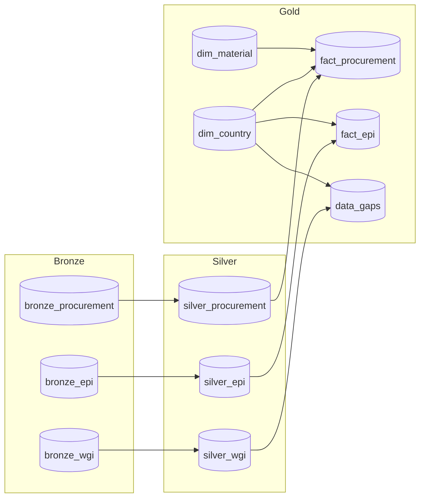

# Data Coverage Dashboard

## Status Summary

```
┌──────────────────────────────────────────────────────────┐
│  COVERAGE STATUS                                         │
├──────────────────────────────────────────────────────────┤
│  Coverage Rate    100%        Total Spend    €4,051,020  │
│  Countries        12/12       Last Run       2026-01-19  │
│  EPI Coverage     100%        WGI Coverage   100%        │
│  Status           HEALTHY                                │
└──────────────────────────────────────────────────────────┘
```

---

## Coverage by Country

| Country | ISO3 | Region | EPI | WGI | Spend (EUR) | % of Total |
|---------|------|--------|:---:|:---:|------------:|------------|
| Singapore | SGP | Asia-Pacific | ✅ | ✅ | €1,784,153 | 44.0% |
| Canada | CAN | Americas | ✅ | ✅ | €626,781 | 15.5% |
| Germany | DEU | Europe | ✅ | ✅ | €267,204 | 6.6% |
| Dem. Rep. Congo | COD | Africa | ✅ | ✅ | €137,371 | 3.4% |
| China | CHN | Asia-Pacific | ✅ | ✅ | €126,388 | 3.1% |
| Chile | CHL | Americas | ✅ | ✅ | €97,086 | 2.4% |
| United States | USA | Americas | ✅ | ✅ | €85,598 | 2.1% |
| France | FRA | Europe | ✅ | ✅ | €68,722 | 1.7% |
| Sweden | SWE | Europe | ✅ | ✅ | €40,461 | 1.0% |
| Netherlands | NLD | Europe | ✅ | ✅ | €40,012 | 1.0% |
| Mexico | MEX | Americas | ✅ | ✅ | €0 | 0% |
| Malaysia | MYS | Asia-Pacific | ✅ | ✅ | €0 | 0% |

**Coverage Status Key:**
- **Full Coverage** = EPI + WGI (all 5 indicators)
- **EPI Only** = Environmental data, no governance
- **WGI Only** = Governance data, no environmental
- **No Coverage** = Neither dataset available

---

## Data Flow



---

## Risk Points

| Risk | Location | Impact | Current Status |
|------|----------|--------|----------------|
| Unmapped Materials | Procurement → Material join | Unknown classification for some spend | ⚠️ Monitor `unmapped_materials` |
| Unmapped Countries | Procurement → Country join | Unknown risk for some spend | ⚠️ Monitor `unmapped_countries` |
| EPI Mismatch | EPI → Country join | Countries dropped from sustainability | ✅ 0 countries affected |
| WGI Partial | WGI requires 5/5 indicators | Partial data = no coverage | ✅ All countries have 5/5 |

**WGI Required Indicators:**
1. Voice and Accountability
2. Political Stability
3. Government Effectiveness
4. Regulatory Quality
5. Control of Corruption

---

## Architecture

```
Bronze (Raw) ──► Silver (Cleaned) ──► Gold (Analytics)
```

| Layer | Tables | Purpose |
|-------|--------|---------|
| Bronze | `bronze_*` | Raw ingestion from sources |
| Silver | `silver_*` | Cleaned, standardized, typed |
| Gold | `gold_*`, `fact_*`, `dim_*` | Star schema for analytics |

---

## Related Documentation

- [Data Quality Framework](./data_quality_framework.md) - Quality dimensions and checks
- [External Data Automation](./external_data_automation.md) - EPI/WGI source details
- [Business Requirements](./business_requirements.md) - Stakeholder expectations

---

*Last Updated: 2026-01-19*
