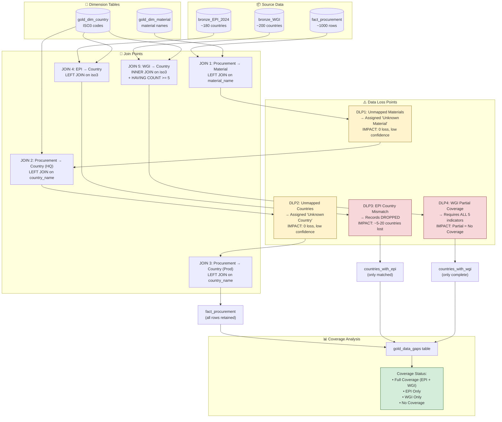

# Data Coverage Flow Visualization

This document explains how data flows through the OEMMatInsightBI pipeline, highlighting where joins occur, where data might be lost, and the business impact of each loss point.

---

## Data Flow Diagram



---

## Data Loss Points Explained

| Point | Location | What Happens | Records Lost | Business Impact |
|-------|----------|--------------|--------------|-----------------|
| **DLP1** | Procurement → Material | Unmatched materials get `material_key = NULL` → Replaced with "Unknown Material" | **0** | No loss, but €X spend has unknown material classification |
| **DLP2** | Procurement → Country | Unmatched countries get `country_key = NULL` → Replaced with "Unknown Country" | **0** | No loss, but €X spend has unknown country risk |
| **DLP3** | EPI → Country | EPI ISO codes that don't match `dim_country.iso3` are **dropped** | **5-20** | Countries with EPI data excluded from sustainability analysis |
| **DLP4** | WGI → Country | Countries with <5 WGI indicators marked as "No WGI" | **Variable** | Partial governance data treated as no governance data |

---

## How Coverage is Calculated

The `gold_data_gaps` table determines coverage status for each country used in procurement:

### Step 1: Identify Procurement Countries
```sql
-- All unique countries from fact_procurement (HQ + Production)
SELECT DISTINCT country_key FROM fact_procurement
```

### Step 2: Check EPI Coverage
```sql
-- Countries that have EPI data joined via ISO3
SELECT country_key FROM gold_fact_epi
WHERE epi_score IS NOT NULL
```

### Step 3: Check WGI Coverage (Strict)
```sql
-- Countries must have ALL 5 WGI indicators:
-- 1. Voice and Accountability
-- 2. Political Stability and Absence of Violence/Terrorism
-- 3. Government Effectiveness
-- 4. Regulatory Quality
-- 5. Control of Corruption
SELECT country_key
FROM gold_fact_wgi
GROUP BY country_key
HAVING COUNT(DISTINCT indicator_name) = 5
```

### Step 4: Determine Coverage Status
```
Coverage Status = CASE
    WHEN has_epi AND has_wgi_complete THEN 'Full Coverage'
    WHEN has_epi AND NOT has_wgi_complete THEN 'EPI Only'
    WHEN NOT has_epi AND has_wgi_complete THEN 'WGI Only'
    ELSE 'No Coverage'
END
```

---

## Key Insight: The Coverage Overlap

The `gold_data_gaps` table answers: **"For each procurement country, do we have EPI and WGI data?"**

```
Procurement Countries (12 in sample)
├── Countries with EPI: 12 (100%) ← All matched
├── Countries with WGI (all 5 indicators): 12 (100%) ← All matched
└── Coverage Status:
    ├── Full Coverage: 12 (100%)
    ├── EPI Only: 0
    ├── WGI Only: 0
    └── No Coverage: 0
```

---

## Why Sample Data Shows 100% Coverage

The current sample data shows 100% coverage because all 12 procurement countries are **major economies** with complete external data:

| Country | EPI Status | WGI Status | Notes |
|---------|------------|------------|-------|
| Germany | ✅ Complete | ✅ All 5 indicators | Major EU economy |
| China | ✅ Complete | ✅ All 5 indicators | Major global supplier |
| USA | ✅ Complete | ✅ All 5 indicators | Major economy |
| Japan | ✅ Complete | ✅ All 5 indicators | Major economy |
| ... | ... | ... | ... |

**Real-world scenarios where gaps would appear:**
- Emerging markets (some smaller African/Asian countries)
- Disputed territories (Taiwan, Kosovo)
- Micro-states (Monaco, San Marino)
- Recently independent nations

---

## Impact Analysis by Data Loss Point

### DLP1 & DLP2: Unmapped Values (Low Risk)
- **No data loss** - records are retained with fallback keys
- **Impact**: Reduced analytical confidence
- **Mitigation**: Review `unmapped_countries` / `unmapped_materials` tables regularly

### DLP3: EPI Country Mismatch (Medium Risk)
- **Data loss**: Countries in EPI data that don't exist in dim_country
- **Impact**: Sustainability scores unavailable for some procurement origins
- **Mitigation**: Expand country alias mappings in `country_alias_mapping.md`

### DLP4: WGI Partial Coverage (Medium-High Risk)
- **Data loss**: Countries with 1-4 WGI indicators treated as having NO governance data
- **Impact**: Binary "all or nothing" - partial data provides no value
- **Mitigation**: Consider relaxing to "3+ indicators" or "core indicators only"

---

## Related Documents

- [Data Quality Framework](./data_quality_framework.md) - ISO 25012 quality dimensions
- [Business Requirements](./business_requirements.md) - Stakeholder expectations for data coverage
- [External Data Automation](./external_data_automation.md) - EPI/WGI source details

---

*Last Updated: 2026-01-17*
*Purpose: Visualize data flow and identify coverage risks*
