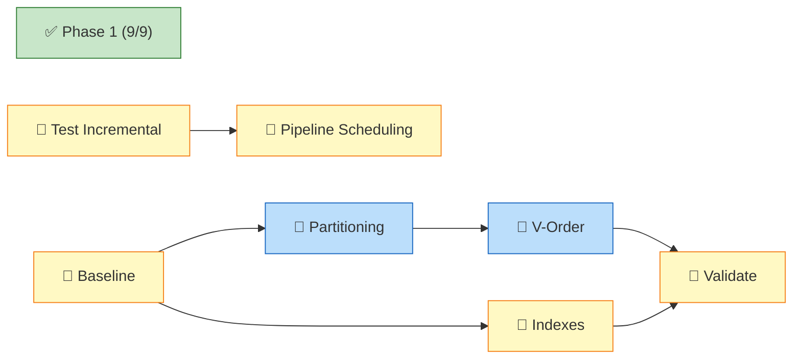

# Dashboard

<!-- DASHBOARD META
generated: 2026-04-29T00:00:00Z
task_hash: sha256:59d9d2c6710e730d
task_count: 29
spec_fingerprint: sha256:93c01f3a54750f35
template_version: 3.0.0
verification_debt: 0
drift_deferrals: 0
-->

**OEMMatInsightBI** — 69% complete (20/29 atomic tasks; 16/19 spec tasks finished, 2 broken down)

*Updated 2026-04-29 — may not reflect changes made outside `/work`*

**Next:** Deploy incremental load changes to Fabric and run full + incremental tests — [task-006_3](tasks/task-006_3.json).

<!-- SECTION TOGGLES -->

Section toggles

- [x] Action Required
- [x] Progress
- [x] Tasks
- [ ] Decisions
- [x] Notes
- [ ] Custom Views

<!-- END SECTION TOGGLES -->

---

## 🚨 Action Required

### Your Tasks

| Task | What To Do | Where |
|------|-----------|-------|
| 006_3 | Deploy incremental load changes to Fabric, run full + incremental tests, verify no duplicates | [task-006_3.json](tasks/task-006_3.json) |
| 010 | Configure pipeline scheduling in Fabric UI (daily 6:00 AM) | [task-010.json](tasks/task-010.json) |
| 012_1 | Run baseline performance measurements in Fabric (3 pipeline runs, record activity durations) | [task-012_1.json](tasks/task-012_1.json) |

<!-- FEEDBACK:task-006_3 -->
**Task 006_3 — Feedback:**
[Leave feedback here, then run /work complete 006_3]
<!-- END FEEDBACK:task-006_3 -->

<!-- FEEDBACK:task-010 -->
**Task 010 — Feedback:**
[Leave feedback here, then run /work complete task-010]
<!-- END FEEDBACK:task-010 -->

<!-- FEEDBACK:task-012_1 -->
**Task 012_1 — Feedback:**
[Leave feedback here, then run /work complete task-012_1]
<!-- END FEEDBACK:task-012_1 -->

---

## 📊 Progress

| Phase | Done | Total | Status |
|-------|------|-------|--------|
| Phase 1 — Core Data Model & Reports | 9 | 9 | Complete |
| Phase 2 — Automation & Quality | 6 | 7 | 1 task awaiting your action (006_3) |
| Phase 3 — Operations & Performance | 1 | 7 | Pipeline scheduling (010) + 5 performance subtasks (012_1–012_5) |

**What was done this session:**
- ✅ Incremental load: bronze date filtering (006_1a), silver Delta MERGE (006_1b), gold Delta MERGE (006_1c), pipeline wiring (006_2)
- ✅ External data automation: EPI + WGI ingestion notebooks (005)
- ✅ Data quality framework: 9 check functions across all layers (007)
- ✅ Error handling: retry logic + execution logging + recovery playbook (011)

**Remaining:** 7 tasks (1 incremental test + 1 scheduling + 5 performance subtasks)

### Project Overview

---

## 📋 Tasks

### Phase 1 — ✅ Core Data Model & Reports (9/9)

✅ 9 tasks finished

### Phase 2 — Automation & Quality (6/7)

| ID | Title | Status | Diff | Owner | Deps |
|----|-------|--------|------|-------|------|
| 005 | Automate External Data Ingestion | Finished | 5 | 🤖 | — |
| 006 | Implement Incremental Load Logic | Broken Down | 7 | 🤖 | — |
| ↳ 006_1a | Bronze: Date-parameter filtering | Finished | 4 | 🤖 | — |
| ↳ 006_1b | Silver: Delta MERGE in cleaning notebook | Finished | 5 | 🤖 | — |
| ↳ 006_1c | Gold: Incremental fact_procurement updates | Finished | 5 | 🤖 | — |
| ↳ 006_2 | Wire pipeline parameters to activities | Finished | 4 | 🤖 | 006_1a, 006_1b, 006_1c ✅ |
| ↳ 006_3 | Test incremental load end-to-end | **Pending** | 3 | 👥 | 006_2 ✅ |
| 007 | Add Comprehensive Data Quality Checks | Finished | 6 | 🤖 | task-018 ✅ |
| 016 | Guided Power BI Dashboard Building | Finished | 3 | 👥 | — |
| 017 | Populate Quality History with Sample Data | Finished | 4 | 🤖 | — |
| 018 | Implement Quality Observability Tables | Finished | 5 | 🤖 | — |
| 019 | Add Quality Tables to Semantic Model | Finished | 4 | 🤖 | — |

### Phase 3 — Operations & Performance (1/7)

| ID | Title | Status | Diff | Owner | Deps |
|----|-------|--------|------|-------|------|
| 010 | Configure Pipeline Scheduling | **Pending** | 3 | 👥 | task-011 ✅ |
| 011 | Implement Error Handling & Retry Logic | Finished | 6 | 🤖 | — |
| 012 | Optimize Pipeline Performance | Broken Down | 7 | 👥 | — |
| ↳ 012_1 | Establish performance baseline | **Pending** | 3 | 👥 | — |
| ↳ 012_2 | Implement partitioning on fact tables | **Pending** | 5 | 🤖 | 012_1 |
| ↳ 012_3 | Enable V-Order and add broadcast hints | **Pending** | 4 | 🤖 | 012_2 |
| ↳ 012_4 | Author warehouse index DDL | **Pending** | 4 | 👥 | 012_1 |
| ↳ 012_5 | Performance retest and validation | **Pending** | 4 | 👥 | 012_2, 012_3, 012_4 |

---

## 💡 Notes

<!-- USER SECTION -->
[Your notes here — ideas, questions, reminders]
<!-- END USER SECTION -->

---
*2026-04-29 · 29 tasks · [Spec aligned](# "0 drift deferrals, 0 verification debt")*
