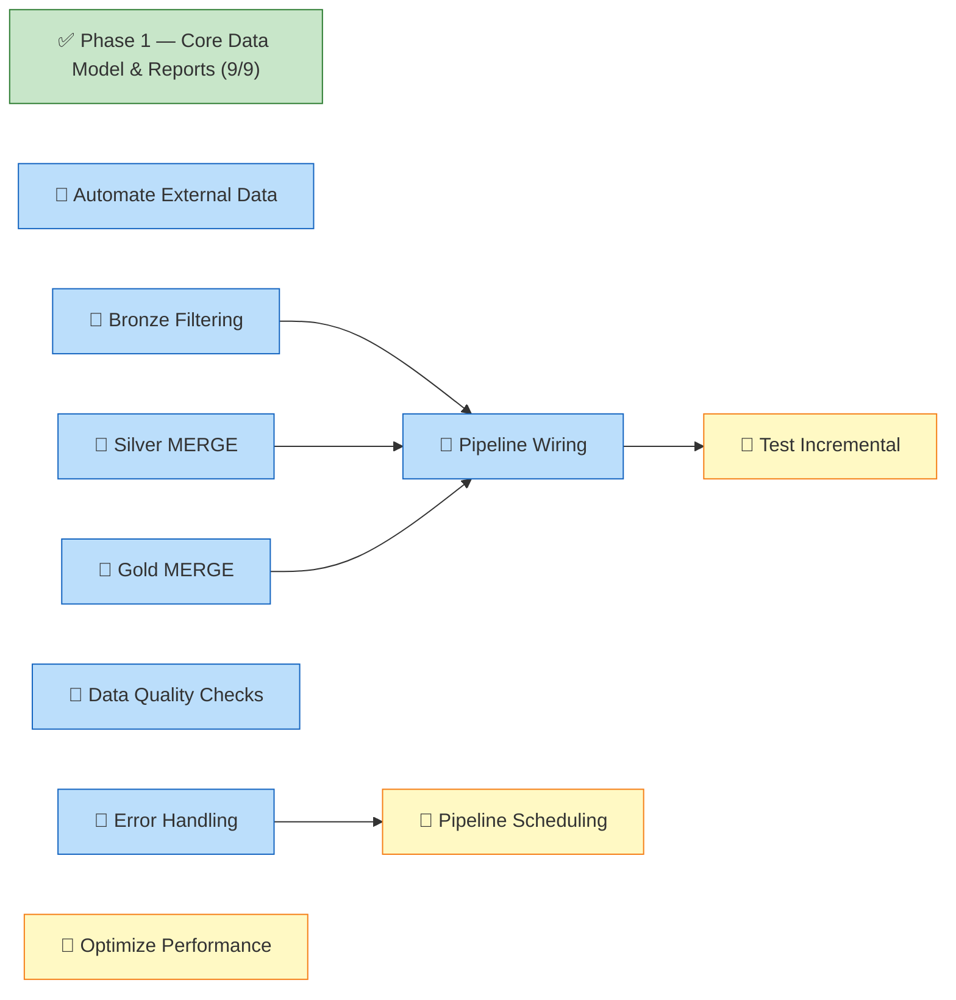

# Dashboard

<!-- DASHBOARD META
generated: 2026-04-05T14:05:00Z
task_hash: sha256:a11dcc3dc5f5274e
task_count: 24
spec_fingerprint: sha256:93c01f3a54750f35
template_version: 1.5.0
verification_debt: 0
drift_deferrals: 0
-->

**OEMMatInsightBI** — 68% complete (13/19 spec tasks)

*Updated 2026-04-05 14:05 — may not reflect changes made outside `/work`*

<!-- SECTION TOGGLES -->

Section toggles

- [x] Action Required
- [x] Progress
- [x] Tasks
- [ ] Decisions
- [x] Notes
- [ ] Custom Views

<!-- END SECTION TOGGLES -->

---

## 🚨 Action Required

### Phase Transitions

<!-- PHASE GATE:1→2 -->
**Phase 1 → Phase 2 Transition**

Conditions:
- [x] All Phase 1 tasks finished (9/9)
- [x] All verifications passed (9/9)
- [ ] Approve transition to Phase 2

<!-- END PHASE GATE:1→2 -->

### Your Tasks

| Task | What To Do | Where |
|------|-----------|-------|
| 006_3 | Deploy incremental load changes to Fabric, run full + incremental tests, verify no duplicates | [task-006_3.json](tasks/task-006_3.json) |
| 010 | Configure pipeline scheduling in Fabric UI (blocked by task-011) | [task-010.json](tasks/task-010.json) |
| 012 | Run performance baselines in Fabric, validate optimization gains | [task-012.json](tasks/task-012.json) |

<!-- FEEDBACK:task-010 -->
**Task 010 — Feedback:**
[Leave feedback here, then run /work complete task-010]
<!-- END FEEDBACK:task-010 -->

<!-- FEEDBACK:task-012 -->
**Task 012 — Feedback:**
[Leave feedback here, then run /work complete task-012]
<!-- END FEEDBACK:task-012 -->

---

## 📊 Progress

| Phase | Done | Total | Status |
|-------|------|-------|--------|
| Phase 1 — Core Data Model & Reports | 9 | 9 | Complete |
| Phase 2 — Automation & Quality | 4 | 7 | Active |
| Phase 3 — Operations & Performance | 0 | 3 | Blocked (task-011 pending) |
| Phase 4 — CI/CD Deployment | 0 | 0 | Planned |

**Critical path:** 🤖 Task 006 (3 parallel subtasks) → 🤖 Task 006_2 → 👥 Task 006_3 → Done *(3 steps)*

### Project Overview

---

## 📋 Tasks

### Phase 1 — ✅ Core Data Model & Reports (9/9)

✅ 9 tasks finished

### Phase 2 — Automation & Quality (4/7)

| ID | Title | Status | Diff | Owner | Deps |
|----|-------|--------|------|-------|------|
| 005 | Automate External Data Ingestion | Pending | 5 | 🤖 | — |
| 006 | Implement Incremental Load Logic | Broken Down | 7 | 🤖 | — |
| ↳ 006_1a | Bronze: Date-parameter filtering | Pending | 4 | 🤖 | — |
| ↳ 006_1b | Silver: Delta MERGE in cleaning notebook | Pending | 5 | 🤖 | — |
| ↳ 006_1c | Gold: Incremental fact_procurement updates | Pending | 5 | 🤖 | — |
| ↳ 006_2 | Wire pipeline parameters to activities | Pending | 4 | 🤖 | 006_1a, 006_1b, 006_1c |
| ↳ 006_3 | Test incremental load end-to-end | Pending | 3 | 👥 | 006_2 |
| 007 | Add Comprehensive Data Quality Checks | Pending | 6 | 🤖 | task-018 ✅ |
| 016 | Guided Power BI Dashboard Building | Finished | 3 | 👥 | — |
| 017 | Populate Quality History with Sample Data | Finished | 4 | 🤖 | — |
| 018 | Implement Quality Observability Tables | Finished | 5 | 🤖 | — |
| 019 | Add Quality Tables to Semantic Model | Finished | 4 | 🤖 | — |

### Phase 3 — Operations & Performance (0/3)

| ID | Title | Status | Diff | Owner | Deps |
|----|-------|--------|------|-------|------|
| 010 | Configure Pipeline Scheduling | Pending | 3 | 👥 | task-011 |
| 011 | Implement Error Handling & Retry Logic | Pending | 6 | 🤖 | — |
| 012 | Optimize Pipeline Performance | Pending | 7 | 👥 | — |

---

## 💡 Notes

<!-- USER SECTION -->
[Your notes here — ideas, questions, reminders]
<!-- END USER SECTION -->

---
*2026-04-05 14:05 · 24 tasks · [Spec aligned](# "0 drift deferrals, 0 verification debt")*
