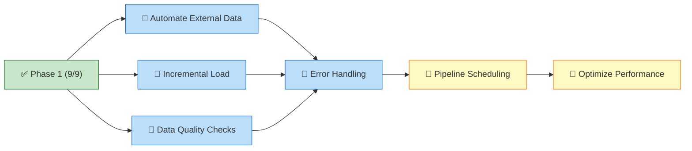

# Dashboard

<!-- DASHBOARD META
generated: 2026-03-10T12:00:00Z
task_hash: sha256:09605e6a3b662861
task_count: 19
spec_fingerprint: sha256:b4041371a843faa2
verification_debt: 0
drift_deferrals: 0
-->

**OEMMatInsightBI** — 68% complete (13/19 tasks)

*Updated 2026-03-10 12:00 — may not reflect changes made outside `/work`*

<!-- SECTION TOGGLES -->

Section toggles

- [x] Action Required
- [x] Progress
- [x] Tasks
- [ ] Decisions
- [x] Notes
- [ ] Custom Views

<!-- END SECTION TOGGLES -->

---

## 🚨 Action Required

### Phase Transitions

<!-- PHASE GATE:1→2 -->
**Phase 1 → Phase 2 Transition**

Conditions:
- [x] All Phase 1 tasks finished (9/9)
- [x] All verifications passed (9/9)
- [ ] Approve transition to Phase 2

<!-- END PHASE GATE:1→2 -->

### Your Tasks

| Task | What To Do | Where |
|------|-----------|-------|
| 010 | Configure pipeline scheduling in Fabric UI | [task-010.json](tasks/task-010.json) |
| 012 | Run performance baselines, validate gains | [task-012.json](tasks/task-012.json) |

<!-- FEEDBACK:task-010 -->
**Task 010 — Feedback:**
[Leave feedback here, then run /work complete task-010]
<!-- END FEEDBACK:task-010 -->

<!-- FEEDBACK:task-012 -->
**Task 012 — Feedback:**
[Leave feedback here, then run /work complete task-012]
<!-- END FEEDBACK:task-012 -->

---

## 📊 Progress

| Phase | Done | Total | Status |
|-------|------|-------|--------|
| Phase 1 | 9 | 9 | Complete |
| Phase 2 | 4 | 7 | Active |
| Phase 3 | 0 | 3 | Blocked (Phase 2 incomplete) |

**Critical path:** 🤖 Task 005 → 🤖 Task 006 → 🤖 Task 007 → 🤖 Task 011 → 👥 Task 010 → 👥 Task 012 → Done *(6 steps)*

### Project Overview

---

## 📋 Tasks

### Phase 1 — ✅ Complete (9/9)

✅ 9 tasks finished

### Phase 2 — Active (4/7)

| ID | Title | Status | Diff | Owner | Deps |
|----|-------|--------|------|-------|------|
| 005 | Automate External Data Ingestion | Pending | 5 | 🤖 | — |
| 006 | Implement Incremental Load Logic | Pending | 7 | 🤖 | — |
| 007 | Add Comprehensive Data Quality Checks | Pending | 6 | 🤖 | task-018 ✅ |
| 016 | Guided Power BI Dashboard Building | Finished | 3 | 👥 | — |
| 017 | Populate Quality History with Sample Data | Finished | 4 | 🤖 | — |
| 018 | Implement Quality Observability Tables | Finished | 5 | 🤖 | — |
| 019 | Add Quality Tables to Semantic Model | Finished | 4 | 🤖 | — |

### Phase 3 — Blocked (0/3)

| ID | Title | Status | Diff | Owner | Deps |
|----|-------|--------|------|-------|------|
| 010 | Configure Pipeline Scheduling | Pending | 3 | 👥 | task-011 |
| 011 | Implement Error Handling & Retry Logic | Pending | 6 | 🤖 | — |
| 012 | Optimize Pipeline Performance | Pending | 7 | 👥 | — |

---

## 💡 Notes

<!-- USER SECTION -->
[Your notes here — ideas, questions, reminders]
<!-- END USER SECTION -->

---
*2026-03-10 12:00 · 19 tasks · [Spec aligned](# "0 drift deferrals, 0 verification debt")*
