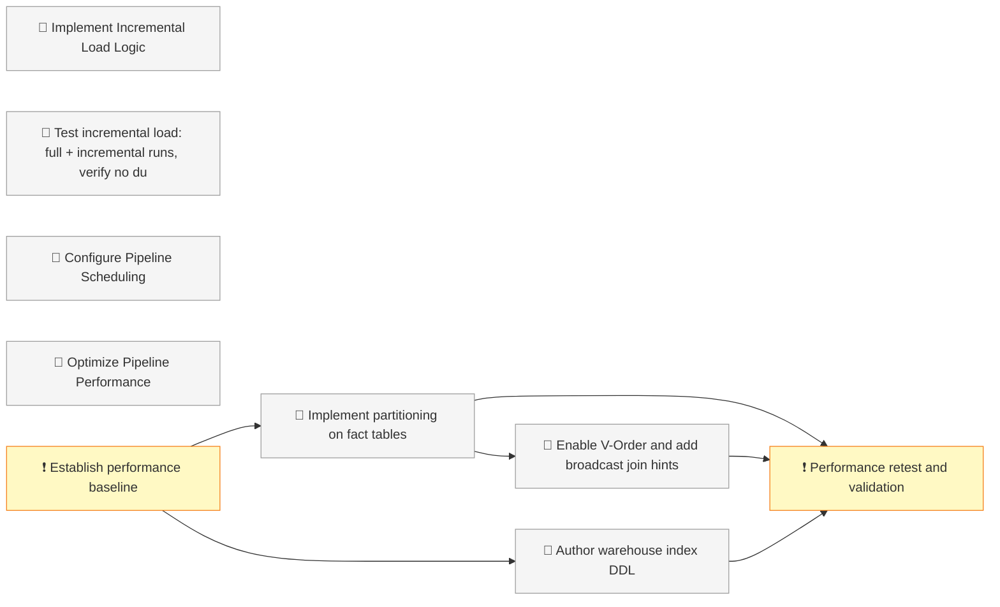

# Dashboard

<!-- DASHBOARD META
generated: 2026-06-13T18:46:08Z
task_count: 30
task_hash: sha256:70603bf5f9fbd12f4f30a96406afdcd63be8b96e9bd66c155d699c7e12979102
spec_version: spec_v1
spec_status: active
spec_fingerprint: sha256:7e40c996d81a395ee50df2b15c591d9635cf4b94e2548b85c47484926e54a2dc
template_version: 4.27.0
verification_debt: 0
drift_deferrals: 0
decision_count: 0
decisions_approved: 0
decisions_superseded: 0
decisions_partially_superseded: 0
-->

<strong>Sections</strong>

<!-- SECTION TOGGLES -->
- [x] Action Required
- [x] Progress
- [x] Tasks
- [ ] Decisions
- [x] Notes
- [ ] Custom Views
<!-- END SECTION TOGGLES -->

**OEMMatInsightBI - Project Definition for Claude Code** · Execute · Started 2026-04-05

**70% complete** — 30 tasks · 0 decisions

*Updated 2026-06-13 18:46 — may not reflect changes made outside `/work`*

---

## 🚨 Action Required

<!-- PHASE GATE:1→2 APPROVED -->

### Your Tasks

| Task | What To Do | Where |
|------|-----------|-------|
| 006_3 | Deploy incremental load changes to Fabric, run full + incremental test loads, verify no duplicate rows — then run `/work complete 006_3` | [task-006_3.json](tasks/task-006_3.json) |
| 010 | Configure pipeline scheduling in Fabric UI (daily 6:00 AM trigger + notification emails) — then run `/work complete 010` | [task-010.json](tasks/task-010.json) |
| 012_1 | Run baseline performance measurements in Fabric (3 pipeline runs, record per-activity durations) — then run `/work complete 012_1` | [task-012_1.json](tasks/task-012_1.json) |
| 020 | ✅ Verified (code + tests) — deploy the updated `data_quality_checks` notebook to Fabric, run it to confirm the 3 new DQ checks pass on live tables, then run `/work complete 020` | [task-020.json](tasks/task-020.json) |

<!-- FEEDBACK:task-006_3 -->
**Task 006_3 — Feedback:**
[Leave feedback here, then run /work complete 006_3]
<!-- END FEEDBACK:task-006_3 -->

<!-- FEEDBACK:task-010 -->
**Task 010 — Feedback:**
[Leave feedback here, then run /work complete 010]
<!-- END FEEDBACK:task-010 -->

<!-- FEEDBACK:task-012_1 -->
**Task 012_1 — Feedback:**
[Leave feedback here, then run /work complete 012_1]
<!-- END FEEDBACK:task-012_1 -->

<!-- FEEDBACK:task-020 -->
**Task 020 — Feedback:**
[Leave feedback here (e.g. Fabric run results), then run /work complete 020]
<!-- END FEEDBACK:task-020 -->

---

## 📊 Progress

| Status | Count |
|--------|-------|
| Finished | 21 |
| Pending | 7 |
| Broken Down | 2 |

| Phase | Done | Total | Status |
|-------|------|-------|--------|
| Phase 1 | 9 | 9 | Complete |
| Phase 2 | 11 | 13 | Active |
| Phase 3 | 1 | 8 | Blocked (awaiting prior phase) |

**Critical path:** ❗ Establish performance baseline → 🤖 Implement partitioning on fact tables → 🤖 Enable V-Order and add broadcast join hints → ❗ Performance retest and validation → Done *(4 steps)*

### Project Overview

---

## 📋 Tasks

### Phase 1

✅ 9 tasks finished

### Phase 2

✅ 11 tasks finished

| ID | Title | Status | Diff | Owner | Deps |
|----|-------|--------|------|-------|------|
| task-006 | Implement Incremental Load Logic | Broken Down | 7 | claude | Azure SQL source has Date field for filtering, Delta Lake format supports MERGE operations (already using Delta), Pipeline parameter passing working correctly, No schema changes during incremental loads |
| task-006_3 | Test incremental load: full + incremental runs, verify no duplicates | Pending | 3 | both | task-006_2 |

*Phase 2: 11/13 complete (85%) — 1 pending*

### Phase 3

| ID | Title | Status | Diff | Owner | Deps |
|----|-------|--------|------|-------|------|
| task-010 | Configure Pipeline Scheduling | Pending | 3 | both | task-011, Pipeline must be fully tested and working, Source systems must be available at scheduled time (6:00 AM), Fabric workspace must have capacity for scheduled execution, Notification email addresses configured |
| task-011 | Implement Error Handling & Retry Logic | Finished | 6 | claude | Pipeline edit permissions in Fabric, Email server configuration for notifications, Access to execution logs in Fabric, Ability to create lakehouse tables (error log) |
| task-012 | Optimize Pipeline Performance | Broken Down | 7 | both | Baseline performance measurements (need to run pipeline), Delta Lake format (already in use), Fabric capacity sufficient for V-Order optimization, SQL endpoint access for warehouse indexing, No schema changes during optimization |
| task-012_1 | Establish performance baseline | Pending | 3 | human | — |
| task-012_2 | Implement partitioning on fact tables | Pending | 5 | claude | task-012_1 |
| task-012_3 | Enable V-Order and add broadcast join hints | Pending | 4 | claude | task-012_2 |
| task-012_4 | Author warehouse index DDL | Pending | 4 | both | task-012_1 |
| task-012_5 | Performance retest and validation | Pending | 4 | human | task-012_2, task-012_3, task-012_4 |

*Phase 3: 1/8 complete (12%) — 6 pending*

*21/30 tasks complete (70%)*

---

## 💡 Notes

<!-- USER SECTION -->

[Your notes here — ideas, questions, reminders]

<!-- END USER SECTION -->

---
*2026-06-13 18:46 UTC · 30 tasks · [Spec aligned](# "0 drift deferrals, 0 verification debt")*
