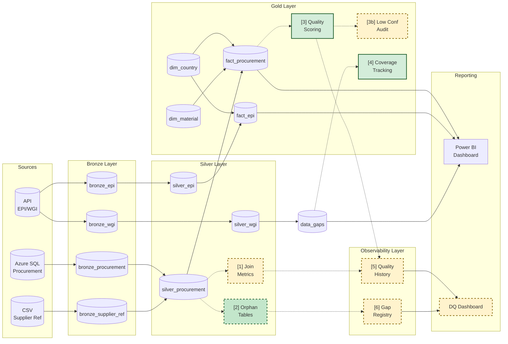

# Data Quality Architecture

## Pipeline Overview



---

## Legend

| Color | Border | Status | Components |
|-------|--------|--------|------------|
| Green (#d4edda) | Solid | **IMPLEMENTED** | Quality Scoring [3], Coverage Tracking [4] |
| Light Green (#c3e6cb) | Dashed | **PARTIAL** | Orphan Tables [2] - exists but missing lifecycle fields |
| Yellow (#fff3cd) | Dashed | **PLANNED** | Join Metrics [1], Low Conf Audit [3b], History [5], Registry [6] |

---

## Quality Touchpoints

### [1] Silver Join Metrics

| Attribute | Value |
|-----------|-------|
| **Status** | PLANNED |
| **Layer** | Silver |
| **Purpose** | Monitor join success rates between tables |

**Metrics to Capture:**
```
gold_join_metrics
├── refresh_timestamp
├── source_entity        -- e.g., silver_procurement
├── join_target          -- e.g., dim_country
├── total_records
├── matched_records
├── match_rate           -- matched/total as percentage
├── new_unmatched_count  -- values not seen before
└── resolved_count       -- previously unmatched, now matched
```

**Current State:** Joins happen but no metrics are captured. You can't see "95% of procurement records matched to a country".

---

### [2] Orphan Tables

| Attribute | Value |
|-----------|-------|
| **Status** | PARTIAL |
| **Layer** | Silver/Gold |
| **Purpose** | Track unmapped values for remediation |

**What Exists:**
```
gold_unmapped_procurement_audit
├── unmapped_value        ✅
├── unmapped_type         ✅ (material, hq_country, prod_country)
├── frequency             ✅
├── spend_impact          ✅
├── first_seen            ❌ MISSING
├── last_seen             ❌ MISSING
├── resolution_status     ❌ MISSING
└── assigned_to           ❌ MISSING
```

**Enhancement Needed:** Add lifecycle fields to track when gaps appeared, how long they've existed, and whether they're being addressed.

---

### [3] Quality Scoring

| Attribute | Value |
|-----------|-------|
| **Status** | IMPLEMENTED |
| **Layer** | Gold |
| **Purpose** | Per-record confidence scoring |

**What Exists:**
```
fact_procurement columns:
├── data_quality_score    ✅ (0-1 scale)
├── quality_category      ✅ (High/Medium/Low/Unmapped)
└── match confidences     ✅ (material, hq_country, prod_country)
```

**Scoring Logic:**
```
data_quality_score = (material_conf + hq_country_conf + prod_country_conf) / 3

quality_category = CASE
    WHEN score >= 0.90 THEN 'High'
    WHEN score >= 0.70 THEN 'Medium'
    WHEN score >= 0.50 THEN 'Low'
    ELSE 'Unmapped'
END
```

---

### [3b] Low Confidence Audit

| Attribute | Value |
|-----------|-------|
| **Status** | PLANNED |
| **Layer** | Gold |
| **Purpose** | Capture matches below 0.95 confidence for review |

**Rationale:** The alias system may auto-match values like "Singpaore" → "Singapore" with 0.85 confidence. These matches are "good enough" but should be surfaced for verification.

**Schema:**
```sql
gold_low_confidence_audit
├── source_value          -- original value ("Singpaore")
├── matched_to            -- what it mapped to ("Singapore")
├── confidence            -- 0.50 - 0.95
├── entity                -- procurement, supply_share
├── match_type            -- material, country
├── frequency             -- how often this occurs
├── spend_impact          -- EUR affected
└── last_seen             -- most recent occurrence
```

**Business Value:** Surface "fuzzy matches" that might be incorrect, separate from truly unmapped values.

---

### [4] Coverage Tracking

| Attribute | Value |
|-----------|-------|
| **Status** | IMPLEMENTED |
| **Layer** | Gold |
| **Purpose** | Track external data availability per procurement country |

**What Exists:**
```
gold_data_gaps
├── country_key
├── country_name
├── iso3
├── region
├── has_epi              ✅
├── has_wgi              ✅ (requires all 5 indicators)
├── coverage_status      ✅ (Full/EPI Only/WGI Only/None)
└── total_spend          ✅

gold_data_gaps_summary
├── coverage_status
├── country_count
├── spend_sum
└── spend_pct
```

**Current Results:** 12/12 countries (100%) have Full Coverage.

---

### [5] Quality History

| Attribute | Value |
|-----------|-------|
| **Status** | PLANNED |
| **Layer** | Observability |
| **Purpose** | Append-only storage of quality metrics per pipeline run |

**Schema:**
```sql
gold_quality_history
├── refresh_timestamp     -- when pipeline ran (UTC)
├── layer                 -- Bronze/Silver/Gold/Pipeline
├── entity                -- table name ('gate' for the DQ gate verdict rows)
├── metric_name           -- e.g., 'coverage_rate', 'match_rate', 'dq_gate_raised'
├── metric_value          -- numeric value
├── threshold             -- optional acceptable level
├── breach_flag           -- metric crossed its threshold? NOT the pipeline gate
├── status                -- per-check verdict 'pass'/'fail'/'warning'; 'n/a' on
│                            non-check rows; NULL only pre-task-040. THIS is the
│                            field the blocking gate reads.
└── producer              -- 'data_quality_checks' | 'silver-to-gold2'
```

**Business Value:**
- Trend quality over time ("coverage improved from 85% to 100%")
- Detect regression ("match rate dropped 5% this week")
- Support SLA reporting

**Capture Timing:** Per pipeline run (append after each bronze→silver→gold execution)

---

### [6] Gap Registry

| Attribute | Value |
|-----------|-------|
| **Status** | PLANNED |
| **Layer** | Observability |
| **Purpose** | SCD tracking of unmapped values with lifecycle management |

**Schema:**
```sql
gold_gap_registry
├── gap_id                -- surrogate key
├── gap_natural_key       -- the unmapped value
├── entity                -- procurement, supply_share
├── gap_type              -- material, country
├── first_seen            -- when gap first appeared
├── last_seen             -- most recent occurrence
├── total_occurrences     -- CURRENT-RUN occurrence count, not cumulative (task-027 / DEC-005).
│                            The audit tables it reads are full snapshots rebuilt every run, so
│                            incrementing measured occurrences x runs. Gap AGE is carried
│                            losslessly by first_seen / last_seen instead.
├── current_status        -- Open/In Progress/Resolved/Excluded
├── estimated_impact      -- EUR or % affected
├── resolution_date       -- when fixed
└── resolution_notes      -- how it was resolved
```

**Merge Logic (per refresh):**
1. **Existing gaps:** Update `last_seen`, **set** `total_occurrences` to the current run's count (task-027 / DEC-005 — see the schema note above; it is not incremented)
1. **Reopened gaps:** a gap whose `current_status` is `Resolved` but which appears again in the current run returns to `Open`, `resolution_date` is cleared, and a dated reopen note preserving the prior resolution is written. There is no separate `Reopened` status — every consumer filters `current_status = 'Open'`, so a new status value would strand the gap (DEC-005 sub-decision 2)
2. **New gaps:** Insert with `first_seen = now`, `status = Open`
3. **Resolved gaps:** Mark `status = Resolved` if value now matches an alias

**Business Value:**
- "This gap has been open for 3 months affecting €50K"
- "We resolved 5 gaps last week, 3 remain"
- "Average gap resolution time: 4 days"

---

## Implementation Priority

| Priority | Component | Effort | Why |
|----------|-----------|--------|-----|
| **1** | [6] Gap Registry | Medium | Track gap lifecycle, answer "how long has this been broken?" |
| **2** | [5] Quality History | Medium | Enable trend analysis and regression detection |
| **3** | [3b] Low Confidence Audit | Low | Surface fuzzy matches for verification |
| **4** | [2] Enhance Orphan Tables | Low | Add first_seen, last_seen, status to existing tables |
| **5** | [1] Silver Join Metrics | Medium | Monitor join health |

---

## Table Definitions

### gold_quality_history
```sql
CREATE TABLE gold_quality_history (
    refresh_timestamp TIMESTAMP,
    layer STRING,
    entity STRING,
    metric_name STRING,
    metric_value DOUBLE,
    threshold DOUBLE,
    breach_flag BOOLEAN,
    status STRING,      -- task-040: per-check verdict; the field the gate reads
    producer STRING     -- task-040: which notebook appended the row
)
```

`status` and `producer` were added to the live table with `ALTER TABLE ... ADD COLUMNS` (the table is append-only and already held history). Rows predating that change carry NULL in both and are not backfilled.

### gold_gap_registry
```sql
CREATE TABLE gold_gap_registry (
    gap_id BIGINT,
    gap_natural_key STRING,
    entity STRING,
    gap_type STRING,
    first_seen TIMESTAMP,
    last_seen TIMESTAMP,
    total_occurrences INT,
    current_status STRING,
    estimated_impact DOUBLE,
    resolution_date TIMESTAMP,
    resolution_notes STRING
)
```

### gold_low_confidence_audit
```sql
CREATE TABLE gold_low_confidence_audit (
    source_value STRING,
    matched_to STRING,
    confidence DOUBLE,
    entity STRING,
    match_type STRING,
    frequency INT,
    spend_impact DOUBLE,
    last_seen TIMESTAMP
)
```

---

## Related Files

**Existing Implementation:**
- `/fabric/silver-to-gold2.Notebook` - Quality scoring logic
- `/fabric/create_quality_views.sql` - 8 monitoring views
- `/src/transformations/data_quality.py` - Quality functions

**Design Documents:**
- `/.claude/support/documents/data_coverage_flow.md` - Coverage dashboard

**Tasks:**
- Task 001 - Enhance Data Quality Visibility
- Task 017 - Populate Quality History & Gap Registry with Sample Data

---

*Last Updated: 2026-01-19*
