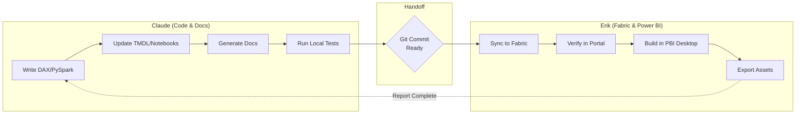

# MISSION CONTROL

**OEMMatInsightBI Project Dashboard**

*Last Updated: 2026-01-15 | Auto-updated by Claude after each work session*

---

## Progress Overview

### Overall Completion
```
Tasks Complete: ██████░░░░░░░░░░░░░░ 13% (2/16)
P1 Tasks:       ██████░░░░░░░░░░░░░░ 13% (1/8)
Claude Work:    ████████████░░░░░░░░ 60% (Design phases done)
Erik Work:      ██░░░░░░░░░░░░░░░░░░ 10% (Awaiting deployments)
```

### Status Badges

| Status | Tasks |
|--------|-------|
| Finished | Task 009, Task 013 |
| In Progress | Task 008, Task 014 |
| Ready | Task 015 (Fix Relationships), Task 016 (Guided Dashboard) |
| Waiting for Erik | Task 014 (deploy), Task 002 (deploy measures) |
| Claude Ready | Task 001, 004, 005, 006, 007, 011 (design done) |
| Pending | Task 003, 010, 012 |

---

## Current Workflow



---

## Your Action Items

### Ready Now

| # | Task | Action | Time | Details |
|---|------|--------|------|---------|
| 1 | **Task 014** | Sync semantic model to Fabric | 5 min | `git push` then [Update from Git in Fabric](https://app.fabric.microsoft.com/groups/99e4cc6d-6ec3-49a7-aed9-b69b04a97aa9) |
| 2 | **Task 014** | Verify measures in Fabric portal | 5 min | Open semantic model → Check _Measures table shows 18 measures |
| 3 | **Task 014** | Open Power BI Desktop & connect | 5 min | Get Data → Power BI semantic models → semantic_model_oeminsightbi |
| 4 | **Task 014** | Build Executive Dashboard page | 30 min | Follow [MEASURE_GUIDE.md](./docs/guides/MEASURE_GUIDE.md) Part 4 layout |
| 5 | **Task 014** | Build Risk & Sustainability page | 30 min | Follow [MEASURE_GUIDE.md](./docs/guides/MEASURE_GUIDE.md) Part 4 layout |
| 6 | **Task 014** | Export screenshots + PDF | 10 min | File → Export → PNG (1920x1080) + PDF |

### After Claude Completes Next Batch

| # | Task | Action | Time | Prerequisite |
|---|------|--------|------|--------------|
| 7 | **Task 004** | Test RLS roles in Fabric | 15 min | Claude implements role definitions |
| 8 | **Task 010** | Configure pipeline schedule | 10 min | Open pipeline → Schedule → Set daily 6AM |

### Blocked (Waiting on Dependencies)

| Task | Blocked By | Estimated Unblock |
|------|------------|-------------------|
| Task 003 (Full Report) | Task 002 (need 40+ DAX measures) | After Task 002 subtasks complete |

---

## Claude's Work Queue

### Completed This Session
- [x] Created MISSION_CONTROL.md (task dashboard with full decomposition)
- [x] Updated CLAUDE.md with auto-update instructions
- [x] Researched MCP integrations for Power BI/Fabric
- [x] Configured Git MCP server in ~/.claude/mcp.json
- [x] Configured Playwright with persistent auth storage

### Currently Working On
- [ ] (Session wrap-up)

### Next Up (Priority Order)
1. **Task 001** - Create data quality notebook + DQ page visuals
2. **Task 004** - Implement RLS role definitions in TMDL
3. **Task 002** - Implement remaining DAX measures (subtasks 002-2 through 002-7)
4. **Task 005** - Implement EPI/WGI automation notebooks
5. **Task 006** - Implement incremental load logic
6. **Task 007** - Create data quality check functions
7. **Task 011** - Configure retry logic in pipeline JSON

---

## Full Task Decomposition

### Task 001: Enhance Data Quality & Matching Visibility
**Priority:** P1 | **Total Steps:** 8 | **Status:** Pending

| Step | Owner | Action | Time | Status |
|------|-------|--------|------|--------|
| 001.1 | Claude | Create data_quality_report.Notebook | 30 min | Pending |
| 001.2 | Claude | Implement quality statistics functions | 45 min | Pending |
| 001.3 | Claude | Create gold_data_quality_dashboard table | 20 min | Pending |
| 001.4 | Claude | Write DQ documentation | 15 min | Pending |
| 001.5 | Erik | Sync notebook to Fabric | 5 min | Pending |
| 001.6 | Erik | Run notebook to populate DQ table | 10 min | Pending |
| 001.7 | Erik | Build Power BI DQ page (4-6 visuals) | 30 min | Pending |
| 001.8 | Erik | Verify metrics and export screenshot | 10 min | Pending |

---

### Task 002: Redesign Semantic Model & DAX Measures
**Priority:** P1 | **Total Steps:** 14 | **Status:** Broken Down (0/7 subtasks)

| Step | Owner | Action | Time | Status |
|------|-------|--------|------|--------|
| 002.1 | Claude | Create _Measures table structure | 15 min | Done (Task 013/014) |
| 002.2 | Claude | Implement 10 Core Procurement measures | 60 min | Partial (6/10 done) |
| 002.3 | Claude | Implement 9 Time Intelligence measures | 60 min | Pending |
| 002.4 | Claude | Implement 8 Sustainability measures | 60 min | Partial (2/8 done) |
| 002.5 | Claude | Implement 7 Risk measures | 45 min | Partial (4/7 done) |
| 002.6 | Claude | Implement 6 Advanced measures | 30 min | Pending |
| 002.7 | Claude | Add measure descriptions | 30 min | Pending |
| 002.8 | Claude | Update MEASURE_GUIDE.md | 15 min | Done |
| 002.9 | Erik | Sync TMDL to Fabric | 5 min | Pending |
| 002.10 | Erik | Verify measures load without errors | 10 min | Pending |
| 002.11 | Erik | Test calculations against known values | 20 min | Pending |
| 002.12 | Erik | Check DirectLake performance | 10 min | Pending |
| 002.13 | Erik | Document any issues found | 10 min | Pending |
| 002.14 | Claude | Fix any reported issues | Variable | Pending |

---

### Task 003: Redesign Power BI Report
**Priority:** P1 | **Total Steps:** 14 | **Status:** Blocked by Task 002

| Step | Owner | Action | Time | Status |
|------|-------|--------|------|--------|
| 003.1 | Claude | Create page layout specifications | 30 min | Done (PORTFOLIO_DESIGN.md) |
| 003.2 | Claude | Define visual-measure mappings | 20 min | Done |
| 003.3 | Claude | Document drill-through relationships | 15 min | Pending |
| 003.4 | Erik | Create Page 1: Executive Overview | 45 min | Blocked |
| 003.5 | Erik | Create Page 2: Sustainability Dashboard | 45 min | Blocked |
| 003.6 | Erik | Create Page 3: Supply Chain Risk | 45 min | Blocked |
| 003.7 | Erik | Create Page 4: Material Deep Dive | 30 min | Blocked |
| 003.8 | Erik | Create Page 5: Data Quality Dashboard | 30 min | Blocked |
| 003.9 | Erik | Add navigation buttons between pages | 15 min | Blocked |
| 003.10 | Erik | Apply professional theme + formatting | 20 min | Blocked |
| 003.11 | Erik | Test all drill-through interactions | 15 min | Blocked |
| 003.12 | Erik | Performance test (<3s per visual) | 10 min | Blocked |
| 003.13 | Erik | Export screenshots + PDF | 15 min | Blocked |
| 003.14 | Claude | Update task status and archive | 5 min | Pending |

---

### Task 004: Design & Implement Row-Level Security
**Priority:** P1 | **Total Steps:** 10 | **Status:** Design Complete

| Step | Owner | Action | Time | Status |
|------|-------|--------|------|--------|
| 004.1 | Claude | Design 6 security roles | 30 min | Done |
| 004.2 | Claude | Write DAX filter expressions | 30 min | Done |
| 004.3 | Claude | Implement roles in TMDL files | 30 min | Pending |
| 004.4 | Claude | Document RLS strategy | 20 min | Done |
| 004.5 | Erik | Sync TMDL to Fabric | 5 min | Pending |
| 004.6 | Erik | Assign test users to roles | 10 min | Pending |
| 004.7 | Erik | Test "View as Role" for each role | 20 min | Pending |
| 004.8 | Erik | Verify no data leakage | 15 min | Pending |
| 004.9 | Erik | Take screenshots for portfolio | 10 min | Pending |
| 004.10 | Claude | Update task status and archive | 5 min | Pending |

---

### Task 005: Automate External Data Ingestion
**Priority:** P2 | **Total Steps:** 10 | **Status:** Research Complete

| Step | Owner | Action | Time | Status |
|------|-------|--------|------|--------|
| 005.1 | Claude | Research EPI download automation | 30 min | Done |
| 005.2 | Claude | Research WGI API automation | 30 min | Done |
| 005.3 | Claude | Create EPI ingestion notebook | 45 min | Pending |
| 005.4 | Claude | Create WGI ingestion notebook | 45 min | Pending |
| 005.5 | Claude | Update pipeline to use notebooks | 20 min | Pending |
| 005.6 | Claude | Write automation documentation | 15 min | Done (partial) |
| 005.7 | Erik | Sync notebooks to Fabric | 5 min | Pending |
| 005.8 | Erik | Test EPI notebook execution | 15 min | Pending |
| 005.9 | Erik | Test WGI notebook execution | 15 min | Pending |
| 005.10 | Erik | Verify data loads to bronze tables | 10 min | Pending |

---

### Task 006: Implement Incremental Load Logic
**Priority:** P2 | **Total Steps:** 12 | **Status:** Design Complete

| Step | Owner | Action | Time | Status |
|------|-------|--------|------|--------|
| 006.1 | Claude | Design incremental strategy | 45 min | Done |
| 006.2 | Claude | Modify bronze dataflow (date filter) | 45 min | Pending |
| 006.3 | Claude | Implement silver merge logic | 60 min | Pending |
| 006.4 | Claude | Implement gold merge logic | 60 min | Pending |
| 006.5 | Claude | Wire pipeline parameters | 30 min | Pending |
| 006.6 | Claude | Create high-water mark tracking | 30 min | Pending |
| 006.7 | Claude | Document incremental strategy | 20 min | Done |
| 006.8 | Erik | Sync all changes to Fabric | 5 min | Pending |
| 006.9 | Erik | Run full load (p_full_load=true) | 15 min | Pending |
| 006.10 | Erik | Run incremental load | 10 min | Pending |
| 006.11 | Erik | Verify no duplicates | 10 min | Pending |
| 006.12 | Erik | Compare performance (full vs incr) | 15 min | Pending |

---

### Task 007: Add Comprehensive Data Quality Checks
**Priority:** P2 | **Total Steps:** 11 | **Status:** Design Complete

| Step | Owner | Action | Time | Status |
|------|-------|--------|------|--------|
| 007.1 | Claude | Design ISO 25012 framework | 45 min | Done |
| 007.2 | Claude | Implement bronze check functions (4) | 45 min | Pending |
| 007.3 | Claude | Implement silver check functions (3) | 45 min | Pending |
| 007.4 | Claude | Implement gold check functions (2) | 30 min | Pending |
| 007.5 | Claude | Implement scoring system | 30 min | Pending |
| 007.6 | Claude | Create gold_quality_audit table | 15 min | Pending |
| 007.7 | Claude | Document DQ framework | 20 min | Done |
| 007.8 | Erik | Sync DQ notebook to Fabric | 5 min | Pending |
| 007.9 | Erik | Run DQ checks on all layers | 20 min | Pending |
| 007.10 | Erik | Review quality scores | 10 min | Pending |
| 007.11 | Erik | Configure alert thresholds | 10 min | Pending |

---

### Task 008: Create Unit Tests for Transformation Functions
**Priority:** P2 | **Total Steps:** 6 | **Status:** In Progress (Framework Done)

| Step | Owner | Action | Time | Status |
|------|-------|--------|------|--------|
| 008.1 | Claude | Set up pytest framework | 30 min | Done |
| 008.2 | Claude | Extract testable modules | 45 min | Done |
| 008.3 | Claude | Write 35+ test cases | 60 min | Done |
| 008.4 | Claude | Document testing approach | 15 min | Done |
| 008.5 | Erik | Run `pytest` locally | 5 min | Pending |
| 008.6 | Erik | Review test coverage report | 5 min | Pending |

---

### Task 009: Document Existing DAX Measures
**Priority:** P2 | **Total Steps:** 3 | **Status:** Finished

| Step | Owner | Action | Time | Status |
|------|-------|--------|------|--------|
| 009.1 | Claude | Investigate semantic model | 20 min | Done |
| 009.2 | Claude | Document findings | 10 min | Done |
| 009.3 | Claude | Update recommendations | 5 min | Done |

---

### Task 010: Configure Pipeline Scheduling
**Priority:** P3 | **Total Steps:** 6 | **Status:** Pending

| Step | Owner | Action | Time | Status |
|------|-------|--------|------|--------|
| 010.1 | Claude | Document schedule requirements | 15 min | Done |
| 010.2 | Claude | Write scheduling instructions | 10 min | Pending |
| 010.3 | Erik | Open pipeline in [Fabric](https://app.fabric.microsoft.com/groups/99e4cc6d-6ec3-49a7-aed9-b69b04a97aa9) | 2 min | Pending |
| 010.4 | Erik | Configure schedule (Daily 6AM Stockholm) | 5 min | Pending |
| 010.5 | Erik | Configure failure notifications | 5 min | Pending |
| 010.6 | Erik | Verify first scheduled run completes | 10 min | Pending |

---

### Task 011: Implement Error Handling & Retry Logic
**Priority:** P3 | **Total Steps:** 11 | **Status:** Design Complete

| Step | Owner | Action | Time | Status |
|------|-------|--------|------|--------|
| 011.1 | Claude | Design error handling strategy | 45 min | Done |
| 011.2 | Claude | Define retry configurations | 20 min | Done |
| 011.3 | Claude | Update pipeline JSON with retries | 30 min | Pending |
| 011.4 | Claude | Create execution log table schema | 20 min | Pending |
| 011.5 | Claude | Implement logging functions | 45 min | Pending |
| 011.6 | Claude | Write error recovery playbook | 30 min | Pending |
| 011.7 | Erik | Sync pipeline to Fabric | 5 min | Pending |
| 011.8 | Erik | Test with simulated failure | 15 min | Pending |
| 011.9 | Erik | Verify retry behavior | 10 min | Pending |
| 011.10 | Erik | Configure email notifications | 10 min | Pending |
| 011.11 | Erik | Validate error log population | 10 min | Pending |

---

### Task 012: Optimize Pipeline Performance
**Priority:** P3 | **Total Steps:** 12 | **Status:** Pending

| Step | Owner | Action | Time | Status |
|------|-------|--------|------|--------|
| 012.1 | Erik | Run baseline pipeline (3 times) | 45 min | Pending |
| 012.2 | Erik | Record activity durations | 15 min | Pending |
| 012.3 | Claude | Analyze bottlenecks | 20 min | Pending |
| 012.4 | Claude | Implement partitioning strategy | 60 min | Pending |
| 012.5 | Claude | Enable V-Order in notebooks | 30 min | Pending |
| 012.6 | Claude | Add broadcast join hints | 20 min | Pending |
| 012.7 | Claude | Create warehouse index scripts | 30 min | Pending |
| 012.8 | Erik | Sync optimized code to Fabric | 5 min | Pending |
| 012.9 | Erik | Run OPTIMIZE on gold tables | 15 min | Pending |
| 012.10 | Erik | Create warehouse indexes | 15 min | Pending |
| 012.11 | Erik | Run optimized pipeline (3 times) | 45 min | Pending |
| 012.12 | Erik | Compare performance to baseline | 15 min | Pending |

---

### Task 013: Create Portfolio-Ready Visualizations (Streamlined)
**Priority:** P1 | **Total Steps:** 8 | **Status:** Finished

| Step | Owner | Action | Time | Status |
|------|-------|--------|------|--------|
| 013.1 | Claude | Design 8 strategic DAX measures | 30 min | Done |
| 013.2 | Claude | Write measures to _Measures.tmdl | 30 min | Done |
| 013.3 | Claude | Create PORTFOLIO_DESIGN.md | 45 min | Done |
| 013.4 | Claude | Write CASE_STUDY.md | 60 min | Done |
| 013.5 | Claude | Create PORTFOLIO_ASSETS_README.md | 20 min | Done |
| 013.6 | Erik | Build visuals in Power BI Desktop | 60 min | Moved to Task 014 |
| 013.7 | Erik | Export screenshots + PDF | 15 min | Moved to Task 014 |
| 013.8 | Claude | Archive task | 5 min | Done |

---

### Task 014: Deploy Enhanced Semantic Model & Build Visuals
**Priority:** P1 | **Total Steps:** 11 | **Status:** In Progress (Waiting for Erik)

| Step | Owner | Action | Time | Status |
|------|-------|--------|------|--------|
| 014.1 | Claude | Add 10 new DAX measures | 45 min | Done |
| 014.2 | Claude | Create MEASURE_GUIDE.md | 60 min | Done |
| 014.3 | Claude | Verify TMDL syntax | 10 min | Done |
| 014.4 | Erik | Git commit and push | 5 min | **Ready** |
| 014.5 | Erik | [Sync in Fabric portal](https://app.fabric.microsoft.com/groups/99e4cc6d-6ec3-49a7-aed9-b69b04a97aa9) | 5 min | **Ready** |
| 014.6 | Erik | Verify 18 measures appear | 5 min | Pending |
| 014.7 | Erik | Build Executive Dashboard | 30 min | Pending |
| 014.8 | Erik | Build Risk & Sustainability page | 30 min | Pending |
| 014.9 | Erik | Apply theme + formatting | 15 min | Pending |
| 014.10 | Erik | Export PNG + PDF | 10 min | Pending |
| 014.11 | Claude | Update task status | 5 min | Pending |

---

### Task 015: Fix Semantic Model Relationships
**Priority:** P1 | **Total Steps:** 5 | **Status:** Ready (Prerequisite for Task 016)

| Step | Owner | Action | Time | Status |
|------|-------|--------|------|--------|
| 015.1 | Claude | Diagnose relationship issues in relationships.tmdl | 15 min | Pending |
| 015.2 | Claude | Fix/add missing relationships | 20 min | Pending |
| 015.3 | Erik | Sync updated TMDL to Fabric | 5 min | Pending |
| 015.4 | Erik | Verify relationships in Fabric portal | 5 min | Pending |
| 015.5 | Erik | Test cross-table visuals work | 10 min | Pending |

---

### Task 016: Guided Power BI Dashboard Building
**Priority:** P1 | **Total Steps:** 6 | **Status:** Ready (Depends on Task 015)

| Step | Owner | Action | Time | Status |
|------|-------|--------|------|--------|
| 016.1 | Claude | Provide step-by-step visual instructions | 15 min | Pending |
| 016.2 | Erik | Build visuals following Claude's guidance | 30 min | Pending |
| 016.3 | Claude | Review via screenshot, provide feedback | 10 min | Pending |
| 016.4 | Erik | Apply feedback and build Page 2 | 30 min | Pending |
| 016.5 | Erik | Export PNG + PDF screenshots | 10 min | Pending |
| 016.6 | Claude | Archive completed portfolio assets | 5 min | Pending |

---

## Quick Links

### Fabric Workspace
- **Workspace:** [Open in Fabric](https://app.fabric.microsoft.com/groups/99e4cc6d-6ec3-49a7-aed9-b69b04a97aa9)
- **Lakehouse (oem_lh):** [Open](https://app.fabric.microsoft.com/groups/99e4cc6d-6ec3-49a7-aed9-b69b04a97aa9/lakehouses/488fb9f8-e635-4683-90c4-ba4fee9dfadb)
- **Warehouse (oem_wh):** [Open](https://app.fabric.microsoft.com/groups/99e4cc6d-6ec3-49a7-aed9-b69b04a97aa9/warehouses/b1cb7506-8d2d-4e4a-97cc-2b580da8eda0)

### Key Local Files
- **Measures Guide:** [MEASURE_GUIDE.md](./docs/guides/MEASURE_GUIDE.md)
- **Portfolio Design:** [docs/portfolio/PORTFOLIO_DESIGN.md](./docs/portfolio/PORTFOLIO_DESIGN.md)
- **Case Study:** [docs/portfolio/CASE_STUDY.md](./docs/portfolio/CASE_STUDY.md)
- **DAX Library (full):** [.claude/context/dax_measure_library.md](./.claude/context/dax_measure_library.md)
- **RLS Strategy:** [.claude/context/rls_security_strategy.md](./.claude/context/rls_security_strategy.md)

### Commands
```bash
# Sync local changes to Fabric
git add . && git commit -m "Update from Claude session" && git push

# Run tests locally
cd /Users/erikemilsson/Developer/OEMMatInsightBI
pytest tests/ -v

# Check task status
cat .claude/tasks/task-overview.md
```

---

## Automation Capabilities

### Available MCP Integrations

| MCP Server | Status | What It Automates |
|------------|--------|-------------------|
| **Git** | Configured | Commit, push, status, diff - Claude can manage git directly |
| **GitHub** | Configured | PRs, issues, repo management |
| **Playwright** | Configured | Browser automation with persistent auth |
| **Gemini** | Configured | AI text/image analysis |

### Automation Impact on Workflow

With MCPs configured, here's what changes:

| Before (Manual) | After (Automated) | Owner Change |
|-----------------|-------------------|--------------|
| Erik runs `git push` | Claude uses Git MCP | Erik → Claude |
| Erik clicks "Sync" in Fabric | Playwright (after one-time login) | Erik → Claude |
| Erik takes screenshots manually | Playwright captures | Erik → Claude |

### Playwright Authentication (One-Time Setup)

To enable Fabric portal automation:

1. **One-time login required** - Erik logs into Fabric in Playwright browser
2. **Session persists** - Cookies saved to `~/.claude/playwright-auth/fabric-state.json`
3. **No credentials shared** - Claude never sees your password
4. **Subsequent sessions** - Playwright reuses saved session

**To set up:**
```
1. Claude opens Fabric URL via Playwright
2. Erik manually logs in (browser window appears)
3. Session saved automatically
4. Future automation works without login
```

### Potential Future MCPs

| MCP | What It Would Enable | Status |
|-----|---------------------|--------|
| **Power BI Modeling** | Direct semantic model editing, DAX generation | Available (VS Code) |
| **microsoft-fabric-mcp** | Dataset refresh, DAX queries via API | Requires Azure App setup |
| **mssql-mcp-server** | Direct Azure SQL queries | Requires connection string |

---

## Summary Statistics

| Metric | Value |
|--------|-------|
| Total Steps (all tasks) | 123 |
| Claude Steps | 72 (59%) |
| Erik Steps | 51 (41%) |
| Claude Steps Done | 38 (53% of Claude work) |
| Erik Steps Done | 3 (6% of Erik work) |
| Blocked Steps | 14 (Task 003) |

### Time Estimates

| Category | Estimated Time |
|----------|---------------|
| Claude remaining work | ~12 hours |
| Erik remaining work | ~8 hours |
| Currently blocked | ~4 hours (Task 003) |

---

## Notes

- **Auto-Update:** Claude updates this document after each work session
- **Your Focus:** Check "Your Action Items" section first
- **Priority:** Task 014 is the immediate priority (2-3 hours to portfolio deliverable)
- **Blocking:** Task 003 requires Task 002 completion first
- **New:** Git MCP configured - Claude can now handle git operations directly
- **New:** Playwright auth configured - one-time Fabric login enables automation

---

*Last Session: 2026-01-15*
*Next Action: Complete Task 015 (Fix Relationships) → Task 016 (Guided Dashboard Building)*
