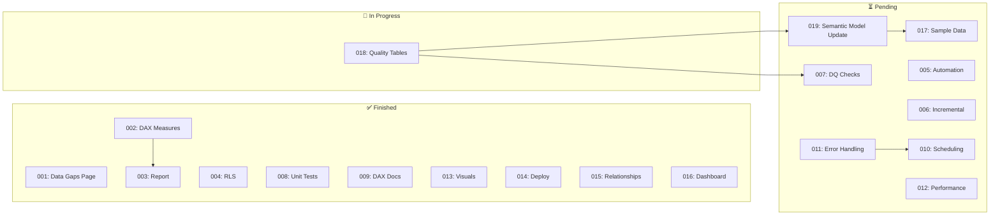
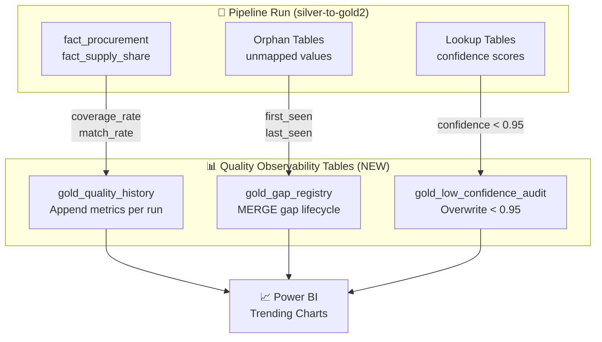

# MISSION CONTROL

**OEMMatInsightBI Project Dashboard**

*Last Updated: 2026-01-20*

---

## Progress Overview

```
Tasks Complete: ███████████████████░░░░░░░░░░░░░ 58% (11/19)
P1 Tasks:       ████████████████████████████████ 100% (8/8 complete)
Claude Work:    ████████████████████████████████ 100% (Ready for Task 019)
```

| Status | Tasks |
|--------|-------|
| **Finished** | 001, 002, 003, 004, 008, 009, 013, 014, 015, 016, **018** |
| **In Progress** | **019** (Erik: sync semantic model) |
| **Pending** | 005, 006, 007, 010, 011, 012, 017 |

### Task Ownership (Pending Tasks)

| Task | Claude Does | Erik Does |
|------|-------------|-----------|
| **018** | ✅ Done | ✅ Verified |
| **019** | ✅ Done (3 TMDL + 17 DAX) | Sync & refresh model |
| **017** | Write sample data script | Run in Fabric |
| **005** | Write Copy Activity + API notebook | Deploy & test |
| **006** | Write MERGE logic + parameters | Deploy & test loads |
| **007** | Write DQ notebook (9 checks) | Deploy & test alerts |
| **011** | Write retry config + logging | Deploy & test failures |
| **010** | Write docs | **Configure in Fabric UI** |
| **012** | Write optimization code | **Run baselines & validate** |

**Ready for Claude now:** 019, 017, 005, 006, 007, 011
**No longer blocked:** 019, 017, 007 (Task 018 verified ✅)
**Primarily Erik tasks:** 010, 012

---

## Visual Overview

### Task Dependencies



### Quality Observability Data Flow (Task 018)



---

## Your Action Items (Erik)

| # | Task | Action |
|---|------|--------|
| 1 | **ALL** | `git pull` to get new TMDL files |
| 2 | **019** | Sync semantic model from Git to Fabric |
| 3 | **019** | Refresh semantic model in Fabric |
| 4 | **019** | Verify 3 new tables appear in Power BI (see below) |

### Task 019 Verification

After syncing and refreshing the semantic model, you should see these new tables:

| Table | Columns | DAX Measures |
|-------|---------|--------------|
| gold_quality_history | 7 | 5 (Latest Coverage Rate, Latest Match Rate, etc.) |
| gold_gap_registry | 11 | 7 (Open Gaps Count, Resolved Gaps Count, etc.) |
| gold_low_confidence_audit | 8 | 5 (Low Confidence Matches Count, etc.) |

All measures are in the "Quality Observability" display folder.

---

## Task 018: Quality Observability Tables ✅ COMPLETE

### What Was Built

**New Tables (Delta format for MERGE support):**
| Table | Purpose | Population Method |
|-------|---------|-------------------|
| `gold_quality_history` | Track quality metrics over time | Append per pipeline run |
| `gold_gap_registry` | SCD tracking of unmapped values | MERGE (update existing, insert new) |
| `gold_low_confidence_audit` | Fuzzy matches for manual review | Overwrite with current state |

**Functions Added to Notebook:**
- `populate_quality_history()` - Captures coverage_rate, match_rate, unmapped_count per entity
- `populate_gap_registry()` - MERGE pattern for gap lifecycle (first_seen, last_seen, occurrences)
- `populate_low_confidence_audit()` - Captures matches with confidence < 0.95

**Business Value:**
- "Coverage improved from 85% to 100% over 3 pipeline runs" (trending)
- "This gap has been open for 3 months affecting €50K" (gap lifecycle)
- "Review these fuzzy matches: Singpaore → Singapore at 85% confidence" (audit)

### Verification Results (2026-01-20)

| Table | Rows | Status |
|-------|------|--------|
| gold_quality_history | 40 | ✅ 4 pipeline runs captured |
| gold_gap_registry | 37 | ✅ MERGE working (first_seen/last_seen tracked) |
| gold_low_confidence_audit | 4 | ✅ Low confidence matches captured |

---

## Task 017: Sample Data for Demo (Pending)

**Depends on:** Task 018 verified working

**Purpose:** Populate quality_history and gap_registry with backdated sample data to demonstrate trending before organic data accumulates.

**Why:** Without historical data, can't demo:
- "Coverage improved from 85% to 100%"
- "This gap has been open for 3 months"

---

## Completed This Session (2026-01-20)

### Task 018 Implementation ✅ VERIFIED
- [x] Created `gold_quality_history` table definition
- [x] Created `gold_gap_registry` table definition
- [x] Created `gold_low_confidence_audit` table definition
- [x] Implemented Quality History append logic
- [x] Implemented Gap Registry MERGE logic
- [x] Implemented Low Confidence Audit capture
- [x] **Erik:** Tested in Fabric - all 3 tables verified with data

### Task 019 Semantic Model (Claude Complete)
- [x] Created `gold_quality_history.tmdl` (7 columns, 5 DAX measures)
- [x] Created `gold_gap_registry.tmdl` (11 columns, 7 DAX measures)
- [x] Created `gold_low_confidence_audit.tmdl` (8 columns, 5 DAX measures)
- [x] Added table references to `model.tmdl`
- [ ] **Erik:** Sync semantic model to Fabric and verify tables

### Documentation Updates
- [x] Updated `data_quality_architecture.md` with refined scope
- [x] Refactored `data_coverage_flow.md` to dashboard format
- [x] Created Task 017 (sample data population)
- [x] Created Task 018 (quality observability tables)

---

## Files Changed (This Session)

| File | Change |
|------|--------|
| `fabric/silver-to-gold2.Notebook/notebook-content.py` | +600 lines: Quality Observability Tables section |
| `.claude/context/data_quality_architecture.md` | Refined scope, added table schemas |
| `.claude/context/data_coverage_flow.md` | Refactored to dashboard format |
| `.claude/tasks/task-017.json` | NEW: Sample data population task |
| `.claude/tasks/task-018.json` | NEW: Quality observability tables task |

---

## Project Summary

| Metric | Value |
|--------|-------|
| Total Tasks | 19 |
| Completed | 11 (58%) |
| In Progress | 1 (019) |
| Pending | 7 |
| P1 Progress | 100% (8/8) |

---

## Quick Links

**Fabric Workspace:**
- [Open Workspace](https://app.fabric.microsoft.com/groups/99e4cc6d-6ec3-49a7-aed9-b69b04a97aa9)
- [Lakehouse (oem_lh)](https://app.fabric.microsoft.com/groups/99e4cc6d-6ec3-49a7-aed9-b69b04a97aa9/lakehouses/488fb9f8-e635-4683-90c4-ba4fee9dfadb)

**Guides:**
- [DQ_PAGE_GUIDE.md](./docs/guides/DQ_PAGE_GUIDE.md) - Build the Data Gaps page
- [data_quality_architecture.md](./.claude/context/data_quality_architecture.md) - Quality observability design

**Commands:**
```bash
git pull                  # Get today's changes
pytest tests/ -v          # Run tests (optional)
```

---

*Last Session: 2026-01-20*
*Next Action: Erik syncs semantic model and verifies Task 019 tables in Power BI*
