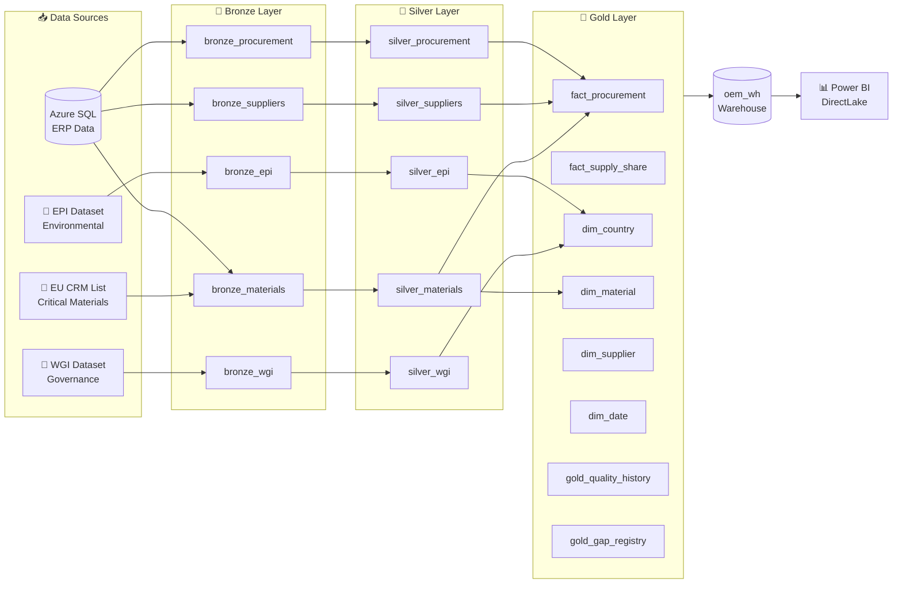

# OEMMatInsightBI


## About

A portfolio project by Erik Emilsson, built while preparing for a data engineering consultant role. The goal is twofold: demonstrate end-to-end proficiency with Microsoft Fabric, and learn production patterns (incremental loading, data quality observability, CI/CD deployment) hands-on.

Companion project: [nordgrid-data-engineering](https://github.com/erikemilsson/nordgrid-data-engineering) — SQL/dbt depth training with 60 progressive exercises covering MERGE, stored procedures, SCD patterns, and Airflow orchestration.

## Overview

A Microsoft Fabric solution demonstrating how OEM databases can be integrated with material databases and ESG datasets to provide real-time insights into the environmental and social impacts of materials used in products.

**Key Technologies:** Azure SQL Database, Fabric Lakehouse & Warehouse, PySpark 3.4+, Power BI, Microsoft.Build.Sql 0.1.19-preview, pytest

## Project Structure

```
azure/                  # SQL scripts for Azure SQL Database setup
data/                   # Sample data files
fabric/                 # All Fabric artifacts
├── oem_lh.Lakehouse/                    # Medallion architecture (bronze/silver/gold)
├── oem_wh.Warehouse/                    # Dimensional model (facts + dims)
│   └── oem_wh.sqlproj                   # Microsoft.Build.Sql project
├── orchestrator_pipeline_bronze_to_gold.DataPipeline  # Main orchestration
├── *_azureSQLdb2table.Dataflow          # Bronze ingestion from Azure SQL
├── *_file2table.Dataflow                # Bronze ingestion from files
├── clean_columnsAndHeaders.Notebook     # Bronze → Silver transformation
├── silver-to-gold2.Notebook             # Silver → Gold transformation
├── semantic_model_oeminsightbi.SemanticModel
└── report.Report
src/transformations/    # Reusable PySpark functions (key generation, data quality)
tests/                  # Unit tests with pytest (requires Python 3.12+, Java 11+)
```

**Local Development:** Clone repo, install `requirements-test.txt`, run `pytest tests/` to validate transformation logic before deploying to Fabric notebooks.

## Use Case

**SwiftBike Tech** (fictional) manufactures electric scooters and bikes with manufacturing plants in Europe and Asia. This project demonstrates how to integrate their ERP data (Azure SQL Database) with external ESG datasets to enable procurement teams to minimize environmental and social impacts.

**Data Sources:**
-   **ESG Indicators:** [Yale Environmental Performance Index](https://epi.yale.edu/), [World Bank Worldwide Governance Indicators](https://www.worldbank.org/en/publication/worldwide-governance-indicators)
-   **Material Data:** Country-level material use-shares at different production stages
-   **Synthetic ERP:** Bill of Materials (BOMs), procurement records, sales tracking

## Architecture



### Medallion Lakehouse (bronze → silver → gold)

**Bronze:** Raw ingestion from Azure SQL (procurement data) and files (ESG indicators)
**Silver:** Cleaned, standardized PySpark transformations with schema enforcement
**Gold:** Business-ready data loaded into `oem_wh.Warehouse` dimensional model

### Pipeline Orchestration

The `orchestrator_pipeline_bronze_to_gold.DataPipeline` manages the full data flow with parameterized incremental loading:

**Key Pipeline Parameters**

| Name | Type | Default Value | Example Value | Consumed in | Purpose |
|--------|--------|--------------------------------|--------|--------|--------|
| procurement_array | Array | \[{"source":"dbo.Suppliers","sink":"bronze_suppliers"},{"source":"dbo.Materials","sink":"bronze_materials","translator":{"type":"TabularTranslator","mappings":\[{"source":{"name":"Material ID","type":"String","physicalType":"String"},"sink":{"name":"Material_ID","physicalType":"string"}},{"source":{"name":"Short Name","type":"String","physicalType":"String"},"sink":{"name":"Short_Name","physicalType":"string"}}\]}},{"source":"dbo.Purchases","sink":"bronze_purchases"}\] | \[{"source":"dbo.Procurement"},{"source":"dbo.Suppliers"}\] | Dataflow / Copy activities | Controls which source tables to ingest for procurement-related data. Useful if you want to add/remove sources without editing activity code. |
| p_full_load | Bool | FALSE | true / false | All Silver notebooks | Full refresh vs. incremental merge |
| p_from_date | String | "1900-01-01" | "2024-01-01" | Silver notebooks | Watermark for incremental loads (filters `order_date >= p_from_date`) |

**Usage:** First run with `p_full_load=true`, subsequent runs with `p_full_load=false` and `p_from_date` set to last successful run timestamp.

### Data Warehouse (oem_wh.Warehouse)

Dimensional model using **Microsoft.Build.Sql 0.1.19-preview** with SqlDwUnifiedDatabaseSchemaProvider and Latin1_General_100_BIN2_UTF8 collation.

**Dimensions:** `dim_country` (ESG indicators), `dim_material`, `dim_supplier`, `dim_date`, `dim_product` (BOM hierarchy)
**Facts:** Procurement transactions, material usage, ESG impact measurements

**Key Design Decisions:**
- Deterministic hash-based surrogate keys (`stable_key()` function in `src/transformations/key_generation.py`)
- SCD Type 1 (current-state tracking)
- Power BI semantic model with DAX measures and star schema relationships

## Testing

Unit tests validate transformation functions locally before deployment to Fabric notebooks.

**Test Coverage:**
- `tests/test_key_generation.py`: Surrogate key consistency and uniqueness (`stable_key`, `generate_*_key` functions)
- `tests/test_data_quality.py`: Null checks, duplicate detection, schema validation

**Quick Start:**
```bash
python3 -m venv .venv && source .venv/bin/activate
pip install -r requirements-test.txt
pytest tests/ -v                          # Run all tests
pytest tests/ --cov=src --cov-report=html # With coverage report
```

**Requirements:** Python 3.12+, Java 11+ (for PySpark). Tests use markers: `@pytest.mark.unit`, `@pytest.mark.integration`, `@pytest.mark.slow`.

## CI/CD Pipeline

This project uses GitHub Actions for continuous integration and quality assurance:

**Automated Checks:**
- ✅ **Unit Tests:** 33 tests run on Python 3.10, 3.11, and 3.12 (matrix testing)
- ✅ **Code Quality:** Black formatting, Flake8 linting, Pylint analysis
- ✅ **Fabric Validation:** JSON schema validation for all pipeline configurations
- ✅ **Documentation:** Link checking and statistics tracking

**Test Results:**
- Current Status: **33 tests passing** (100% success rate)
- Execution Time: ~11 seconds
- Coverage: Core transformation modules (`src/transformations/`)

View test results and reports in the [Actions tab](https://github.com/erikemilsson/OEMMatInsightBI/actions).

## Common Issues

**Surrogate keys changing between runs:** Ensure input columns are trimmed and null-free before calling `stable_key()` from `src/transformations/key_generation.py`.

**Incremental load not working:** Verify `p_full_load=false` and `p_from_date` is set to last successful run timestamp. Check filter uses `>=` not `>`.

**Warehouse build fails:** Ensure `ProjectGuid` exists in `oem_wh.sqlproj` and Microsoft.Build.Sql version matches (0.1.19-preview).

## License

This project is licensed under the MIT License. See the [LICENSE](LICENSE) file for details.

## Author

**Erik Emilsson**

-   [LinkedIn Profile](https://www.linkedin.com/in/erikemilsson/)

-   [GitHub Profile](https://github.com/erikemilsson)