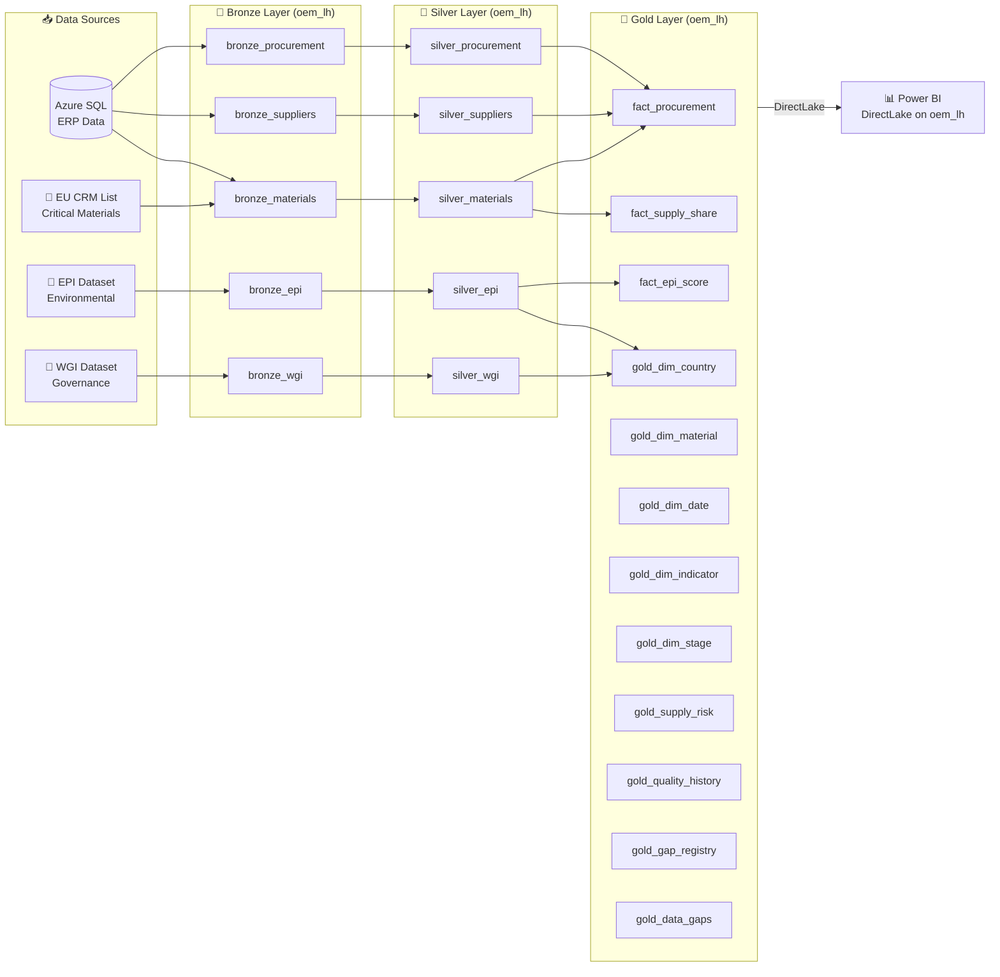

# OEMMatInsightBI


## About

A portfolio project by Erik Emilsson, built while preparing for a data engineering consultant role. The goal is twofold: demonstrate end-to-end proficiency with Microsoft Fabric, and learn production patterns (incremental loading, data quality observability, CI/CD deployment) hands-on.

Companion project: [nordgrid-data-engineering](https://github.com/erikemilsson/nordgrid-data-engineering) — SQL/dbt depth training with 60 progressive exercises covering MERGE, stored procedures, SCD patterns, and Airflow orchestration.

> **Honesty frame:** the procurement ledger is **synthetic**; the external data (Yale EPI, World Bank WGI, EU CRM supply shares) is **real**. The project demonstrates *method and engineering*, not discovered business facts. See [`docs/portfolio/CASE_STUDY.md`](docs/portfolio/CASE_STUDY.md) for the full provenance statement.

## Overview

A Microsoft Fabric solution demonstrating how OEM procurement data can be integrated with material supply-share and ESG datasets to provide insights into the environmental, social, and supply-risk dimensions of sourced materials.

**Key Technologies:** Microsoft Fabric (Lakehouse, Pipelines, Notebooks), PySpark 3.4+, Delta Lake, Power BI / DAX / TMDL (DirectLake), Azure SQL, GitHub Actions, pytest

## What this demonstrates

| Area | What's here | Evidence |
|------|-------------|----------|
| Medallion lakehouse | Bronze → Silver → Gold with PySpark + Delta MERGE and an incremental-load strategy (`p_full_load` / `p_from_date` watermark) | [`docs/architecture/`](docs/architecture/), [`docs/incremental_load_strategy.md`](docs/incremental_load_strategy.md) |
| Measured performance | 3-run warm-cache baseline — functional total **17m 40s** (Bronze 74 s, Silver 142 s, Gold 844 s; pipeline ~19.7 min) — not guessed | [`docs/performance_baseline.md`](docs/performance_baseline.md) |
| Honest null-result | Taiwan has no WGI data (World Bank non-member, permanent). Surfaced as a gap, never coerced to 0 — coercing would understate supply concentration where Taiwan supplies | [`docs/portfolio/CASE_STUDY.md`](docs/portfolio/CASE_STUDY.md) |
| Parity contract | `src/transformations/` is a tested mirror of notebook logic; `tests/` load the notebook's own functions and pin parity against `src/`; intentional semantic gaps are *asserted*, not fixed | [`tests/`](tests/) (via `_notebook_loader.py`), [DEC-002](.claude/support/decisions/decision-002-src-reference-implementation.md) |
| Data-quality observability | A gold observability surface (`gold_data_gaps`, `gold_gap_registry`, `gold_quality_history`, `gold_low_confidence_audit`) plus a *blocking* DQ gate (`data_quality_checks`, 13-entry `BLOCKING_CHECKS`) | [`docs/data_quality_architecture.md`](docs/data_quality_architecture.md) |
| Defended decisions | 6 engineering decisions written up for interview discussion (governance-weight inversion, fixed-bound rescaling, blocking DQ gate, etc.) | [`docs/portfolio/CASE_STUDY.md`](docs/portfolio/CASE_STUDY.md) § "decisions worth defending" |
| Model-as-code | Semantic model defined as TMDL — 14 tables, 10 relationships, 45 measures, DirectLake expression — diffable in git, deployed by `fabric-cicd` | [`fabric/OEMInsightBI_v2.SemanticModel/`](fabric/OEMInsightBI_v2.SemanticModel/), [`docs/dax_measure_library.md`](docs/dax_measure_library.md) |

## Project Structure

```
fabric/                 # All Fabric artifacts
├── oem_lh.Lakehouse/                    # Medallion architecture (bronze/silver/gold)
├── oem_wh.Warehouse/                    # Secondary SQL-project warehouse (oem_wh.sqlproj);
│                                        # NOT the DirectLake serving path (see OEMInsightBI_v2)
├── orchestrator_pipeline_bronze_to_gold.DataPipeline  # 10-activity orchestration
│                                        # (4 Copy + 6 Notebook); Azure SQL ingestion is
│                                        # Copy activities in the pipeline
├── bronze_ingest_epi.Notebook/           # EPI HTTP/API ingestion (replaces EPI_file2table)
├── bronze_ingest_wgi.Notebook/           # WGI HTTP/API ingestion (replaces WGI_file2table)
├── bronze-to-silver.Notebook/           # Bronze → Silver transformation
├── silver-to-gold2.Notebook/            # Silver → Gold: star schema + observability + Delta MERGE
├── data_quality_checks.Notebook/        # Terminal blocking DQ gate
├── pipeline_error_handler.Notebook/     # Runs on every pipeline outcome
├── OEMInsightBI_v2.SemanticModel/       # DirectLake on oem_lh — 45 measures, TMDL
├── report2.Report/                       # 2-page portfolio report
├── EPI_file2table.Dataflow/             # Legacy file ingestion — superseded by notebooks
├── WGI_file2table.Dataflow/             # (items retained, not in the pipeline path)
├── dax/                                  # Reference-only DAX sketches — not deployed
└── sql/                                  # Warehouse SQL (e.g. warehouse_indexes.sql)
src/transformations/    # Tested PySpark mirror of notebook logic (key generation, data quality)
tests/                  # 235 pytest tests (parity contract + transform units)
docs/                   # Canonical documentation surface (architecture, schemas, guides)
```

**Local development:** Clone, install `requirements-test.txt`, run `pytest tests/` to validate transformation logic locally before deploying to Fabric notebooks. See [`CONTRIBUTING.md`](CONTRIBUTING.md) for the full setup and [`docs/setup/TROUBLESHOOTING.md`](docs/setup/TROUBLESHOOTING.md) for common issues.

## Use Case

**SwiftBike Tech** (fictional) manufactures electric scooters and bikes with manufacturing plants in Europe and Asia. This project demonstrates how to integrate their ERP data (Azure SQL Database) with external ESG and supply-share datasets to enable procurement teams to understand environmental, social, and supply-concentration risk across sourced materials.

**Data Sources:**
-   **ESG Indicators:** [Yale Environmental Performance Index](https://epi.yale.edu/), [World Bank Worldwide Governance Indicators](https://www.worldbank.org/en/publication/worldwide-governance-indicators)
-   **Material Supply:** Country-level material use-shares at different production stages (EU CRM critical-materials list + global supply shares)
-   **Synthetic ERP:** Bill of Materials (BOMs), procurement records, sales tracking

## Architecture


```mermaid
flowchart LR
    subgraph Sources["📥 Data Sources"]
        AZ[(Azure SQL<br/>ERP Data)]
        EPI[📄 EPI Dataset<br/>Environmental]
        WGI[📄 WGI Dataset<br/>Governance]
        CRM[📄 EU CRM List<br/>Critical Materials]
    end

    subgraph Bronze["🥉 Bronze Layer (oem_lh)"]
        B1[bronze_procurement]
        B2[bronze_suppliers]
        B3[bronze_materials]
        B4[bronze_epi]
        B5[bronze_wgi]
    end

    subgraph Silver["🥈 Silver Layer (oem_lh)"]
        S1[silver_procurement]
        S2[silver_suppliers]
        S3[silver_materials]
        S4[silver_epi]
        S5[silver_wgi]
    end

    subgraph Gold["🥇 Gold Layer (oem_lh)"]
        F1[fact_procurement]
        F2[fact_supply_share]
        F3[fact_epi_score]
        D1[gold_dim_country]
        D2[gold_dim_material]
        D3[gold_dim_date]
        D4[gold_dim_indicator]
        D5[gold_dim_stage]
        SR[gold_supply_risk]
        QH[gold_quality_history]
        GR[gold_gap_registry]
        DG[gold_data_gaps]
    end

    AZ --> B1 & B2 & B3
    EPI --> B4
    WGI --> B5
    CRM --> B3

    B1 --> S1
    B2 --> S2
    B3 --> S3
    B4 --> S4
    B5 --> S5

    S1 & S2 & S3 --> F1
    S3 --> F2
    S4 & S5 --> D1
    S4 --> F3

    Gold -->|DirectLake| PBI[📊 Power BI<br/>DirectLake on oem_lh]
```

### Medallion Lakehouse (bronze → silver → gold)

All three layers live as Delta tables in the `oem_lh` lakehouse.

- **Bronze:** Raw ingestion from Azure SQL (Copy activities) and EPI/WGI HTTP endpoints (notebooks)
- **Silver:** Cleaned, standardized PySpark transformations with schema enforcement
- **Gold:** Business-ready star schema (3 facts + 5 dimensions + derived supply-risk table) and a data-quality observability surface — served to Power BI via DirectLake

### Pipeline Orchestration

The `orchestrator_pipeline_bronze_to_gold.DataPipeline` manages the full data flow with parameterized incremental loading across 10 activities (4 Copy + 6 Notebook). `pipeline_error_handler` runs on every outcome.

**Key Pipeline Parameters**

| Name | Type | Default | Purpose |
|--------|--------|---------|--------|
| `procurement_array` | Array | dbo.Suppliers / dbo.Materials / dbo.Purchases mappings | Controls which source tables the Copy activities ingest |
| `p_full_load` | Bool | `false` | Full refresh vs. incremental Delta MERGE |
| `p_from_date` | String | `1900-01-01` | Incremental-load watermark (filters `order_date >= p_from_date`) |

**Usage:** First run with `p_full_load=true`; subsequent runs with `p_full_load=false` and `p_from_date` set to the last successful run timestamp. Per-activity retry policy is documented in [`docs/error_recovery_playbook.md`](docs/error_recovery_playbook.md).

### Semantic Model (OEMInsightBI_v2 — DirectLake)

The semantic model is defined as **TMDL** (model-as-code) and serves from the `oem_lh` lakehouse via **DirectLake** — no warehouse in the serving path, no scheduled refresh needed. (`oem_wh.Warehouse` exists as a secondary SQL-project artifact but is not the model source.)

- **Facts:** `fact_procurement`, `fact_supply_share`, `fact_epi_score`
- **Dimensions:** `gold_dim_country`, `gold_dim_material`, `gold_dim_date`, `gold_dim_indicator`, `gold_dim_stage`
- **Derived:** `gold_supply_risk` (governance- and trade-weighted HHI per material × stage × year)
- **Observability:** `gold_data_gaps`, `gold_gap_registry`, `gold_quality_history`, `gold_low_confidence_audit`
- **Measures:** 45 DAX measures across 8 tables, grouped with display folders (no `_Measures` table). Full catalogue: [`docs/dax_measure_library.md`](docs/dax_measure_library.md).

**Key Design Decisions:**
- Deterministic `xxhash64`-based surrogate keys (`stable_key()` in `src/transformations/key_generation.py`)
- SCD Type 1 (current-state tracking)
- DirectLake on `oem_lh` (not a warehouse import mode)

### Architecture Decision Records (ADRs)

Thirteen decisions are captured under [`.claude/support/decisions/`](.claude/support/decisions/). Five most relevant to the portfolio:

- [DEC-001 — Supply Risk gold-model fidelity (EU CRM methodology)](.claude/support/decisions/decision-001-sr-gold-model.md)
- [DEC-002 — `src/` reference implementation guarded by parity tests](.claude/support/decisions/decision-002-src-reference-implementation.md)
- [DEC-005 — Gap-registry lifecycle semantics](.claude/support/decisions/decision-005-gap-registry-lifecycle-semantics.md)
- [DEC-006 — Watermark gold coordination (incremental MERGE)](.claude/support/decisions/decision-006-watermark-gold-coordination.md)
- [DEC-011 — V-Order scope: gold notebook only](.claude/support/decisions/decision-011-vorder-scope-gold-only.md)

## Testing

Unit tests validate transformation functions locally before deployment to Fabric notebooks.

**Coverage:**
- `tests/test_key_generation.py`: surrogate-key consistency and uniqueness (`stable_key`, `generate_*_key`)
- `tests/test_data_quality.py`: null checks, duplicate detection, schema validation
- `tests/test_supply_risk.py`, `tests/test_watermark.py`, `tests/test_procurement_dates.py`: transform logic + the parity contract — notebook functions loaded via `_notebook_loader.py` and pinned against `src/` (Task-032)

**Quick start:**
```bash
python3 -m venv .venv && source .venv/bin/activate
pip install -r requirements-test.txt
pytest tests/ -v                          # 235 tests
pytest tests/ --cov=src --cov-report=html # with coverage
```

**Requirements:** Python 3.12+, Java 11+ (for PySpark). Tests run on Python 3.10, 3.11, and 3.12 in CI.

## CI/CD Pipeline

GitHub Actions for continuous integration and `fabric-cicd` for deployment:

- ✅ **Unit tests:** 235 tests, matrix-tested on Python 3.10 / 3.11 / 3.12
- ✅ **Code quality:** Black formatting, Flake8 / Pylint
- ✅ **Fabric validation:** JSON schema validation for pipeline configurations
- ✅ **Deploy:** `fabric-cicd` publishes the workspace from `fabric/` on merge

View runs in the [Actions tab](https://github.com/erikemilsson/OEMMatInsightBI/actions).

## Portfolio

- **Case study:** [`docs/portfolio/CASE_STUDY.md`](docs/portfolio/CASE_STUDY.md) — the portfolio centerpiece (problem, medallion build, DQ observability, HHI methodology, honest null-result, 6 defended decisions)
- **Report design:** [`docs/portfolio/PORTFOLIO_DESIGN.md`](docs/portfolio/PORTFOLIO_DESIGN.md) — 2-page Power BI report spec for `report2.Report`
- **Assets index:** [`docs/portfolio/PORTFOLIO_ASSETS_README.md`](docs/portfolio/PORTFOLIO_ASSETS_README.md) — code samples, interview narrative, honest-framing LinkedIn template

> **Visual assets** (dashboard screenshots, PDF export) are generated on demand from the live `report2.Report` — see the assets index. They are not committed to the repo.

## License

This project is licensed under the MIT License. See the [LICENSE](LICENSE) file for details.

## Author

**Erik Emilsson**

-   [LinkedIn Profile](https://www.linkedin.com/in/erikemilsson/)
-   [GitHub Profile](https://github.com/erikemilsson)