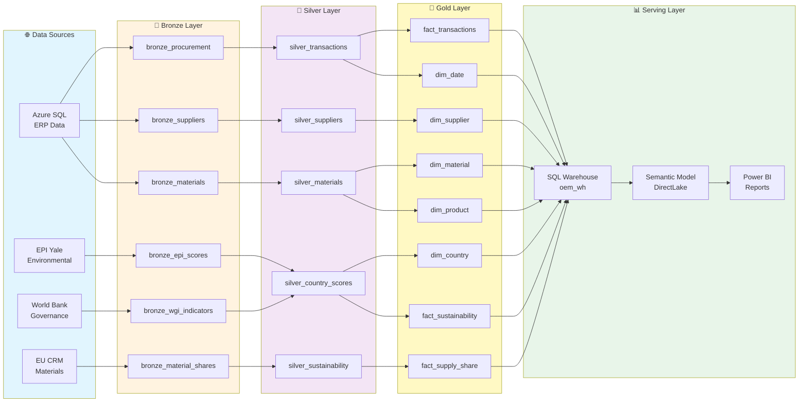
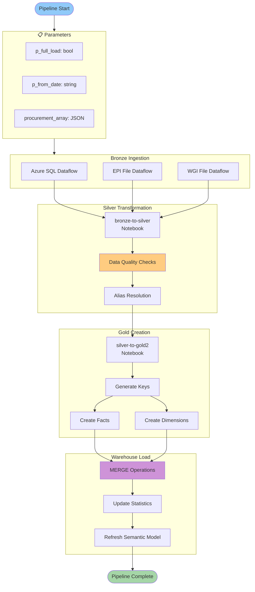
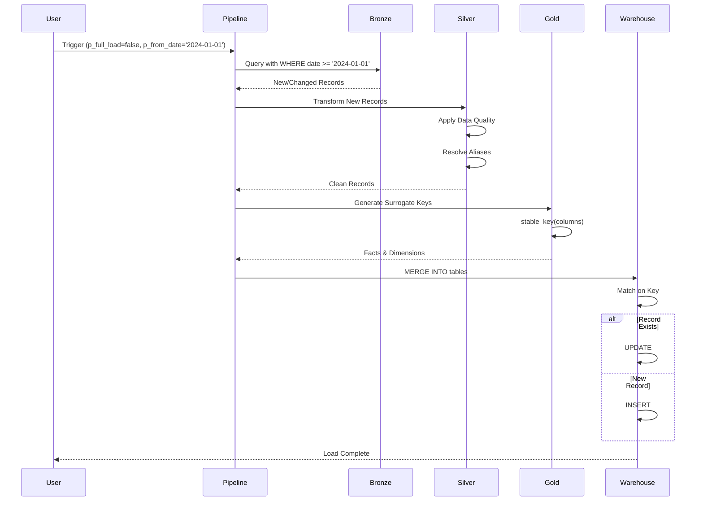
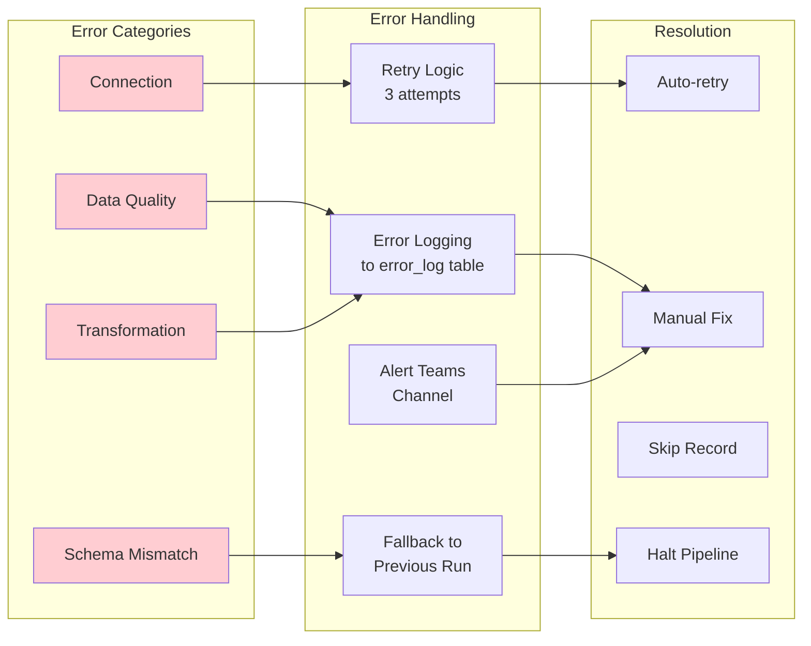

# Data Flow Architecture

## End-to-End Pipeline Flow

```mermaid
graph LR
    subgraph Sources["🌐 Data Sources"]
        SQL[Azure SQL<br/>ERP Data]
        EPI[EPI Yale<br/>Environmental]
        WGI[World Bank<br/>Governance]
        EU[EU CRM<br/>Materials]
    end

    subgraph Bronze["🥉 Bronze Layer"]
        B1[bronze_procurement]
        B2[bronze_suppliers]
        B3[bronze_materials]
        B4[bronze_epi_scores]
        B5[bronze_wgi_indicators]
        B6[bronze_material_shares]
    end

    subgraph Silver["🥈 Silver Layer"]
        S1[silver_transactions]
        S2[silver_suppliers]
        S3[silver_materials]
        S4[silver_country_scores]
        S5[silver_sustainability]
    end

    subgraph Gold["🥇 Gold Layer"]
        F1[fact_transactions]
        F2[fact_supply_share]
        F3[fact_sustainability]
        D1[dim_country]
        D2[dim_material]
        D3[dim_supplier]
        D4[dim_date]
        D5[dim_product]
    end

    subgraph Serving["📊 Serving Layer"]
        WH[SQL Warehouse<br/>oem_wh]
        SM[Semantic Model<br/>DirectLake]
        PBI[Power BI<br/>Reports]
    end

    SQL --> B1
    SQL --> B2
    SQL --> B3
    EPI --> B4
    WGI --> B5
    EU --> B6

    B1 --> S1
    B2 --> S2
    B3 --> S3
    B4 --> S4
    B5 --> S4
    B6 --> S5

    S1 --> F1
    S2 --> D3
    S3 --> D2
    S4 --> D1
    S4 --> F3
    S5 --> F2
    S1 --> D4
    S3 --> D5

    F1 --> WH
    F2 --> WH
    F3 --> WH
    D1 --> WH
    D2 --> WH
    D3 --> WH
    D4 --> WH
    D5 --> WH

    WH --> SM
    SM --> PBI

    style Sources fill:#e1f5fe
    style Bronze fill:#fff3e0
    style Silver fill:#f3e5f5
    style Gold fill:#fff9c4
    style Serving fill:#e8f5e9
```

## Pipeline Orchestration

```mermaid
flowchart TB
    Start([Pipeline Start])

    subgraph Params["📋 Parameters"]
        P1[p_full_load: bool]
        P2[p_from_date: string]
        P3[procurement_array: JSON]
    end

    subgraph Bronze["Bronze Ingestion"]
        B1[Azure SQL Dataflow]
        B2[EPI File Dataflow]
        B3[WGI File Dataflow]
    end

    subgraph Silver["Silver Transformation"]
        S1[bronze-to-silver<br/>Notebook]
        S2[Data Quality Checks]
        S3[Alias Resolution]
    end

    subgraph Gold["Gold Creation"]
        G1[silver-to-gold2<br/>Notebook]
        G2[Generate Keys]
        G3[Create Facts]
        G4[Create Dimensions]
    end

    subgraph Load["Warehouse Load"]
        L1[MERGE Operations]
        L2[Update Statistics]
        L3[Refresh Semantic Model]
    end

    End([Pipeline Complete])

    Start --> Params
    Params --> Bronze
    B1 --> S1
    B2 --> S1
    B3 --> S1
    S1 --> S2
    S2 --> S3
    S3 --> G1
    G1 --> G2
    G2 --> G3
    G2 --> G4
    G3 --> L1
    G4 --> L1
    L1 --> L2
    L2 --> L3
    L3 --> End

    style Start fill:#90caf9
    style End fill:#a5d6a7
    style S2 fill:#ffcc80
    style L1 fill:#ce93d8
```

## Incremental Load Pattern

```mermaid
sequenceDiagram
    participant User
    participant Pipeline
    participant Bronze
    participant Silver
    participant Gold
    participant Warehouse

    User->>Pipeline: Trigger (p_full_load=false, p_from_date='2024-01-01')
    Pipeline->>Bronze: Query with WHERE date >= '2024-01-01'
    Bronze-->>Pipeline: New/Changed Records

    Pipeline->>Silver: Transform New Records
    Silver->>Silver: Apply Data Quality
    Silver->>Silver: Resolve Aliases
    Silver-->>Pipeline: Clean Records

    Pipeline->>Gold: Generate Surrogate Keys
    Gold->>Gold: stable_key(columns)
    Gold-->>Pipeline: Facts & Dimensions

    Pipeline->>Warehouse: MERGE INTO tables
    Warehouse->>Warehouse: Match on Key
    alt Record Exists
        Warehouse->>Warehouse: UPDATE
    else New Record
        Warehouse->>Warehouse: INSERT
    end
    Warehouse-->>User: Load Complete
```

## Error Handling Flow

```mermaid
flowchart LR
    subgraph Errors["Error Categories"]
        E1[Data Quality]
        E2[Schema Mismatch]
        E3[Connection]
        E4[Transformation]
    end

    subgraph Handling["Error Handling"]
        H1[Retry Logic<br/>3 attempts]
        H2[Error Logging<br/>to error_log table]
        H3[Alert Teams<br/>Channel]
        H4[Fallback to<br/>Previous Run]
    end

    subgraph Resolution["Resolution"]
        R1[Auto-retry]
        R2[Manual Fix]
        R3[Skip Record]
        R4[Halt Pipeline]
    end

    E1 --> H2
    E2 --> H4
    E3 --> H1
    E4 --> H2

    H1 --> R1
    H2 --> R2
    H3 --> R2
    H4 --> R4

    style E1 fill:#ffcdd2
    style E2 fill:#ffcdd2
    style E3 fill:#ffcdd2
    style E4 fill:#ffcdd2
```

---

*Last Updated: 2025-12-15*