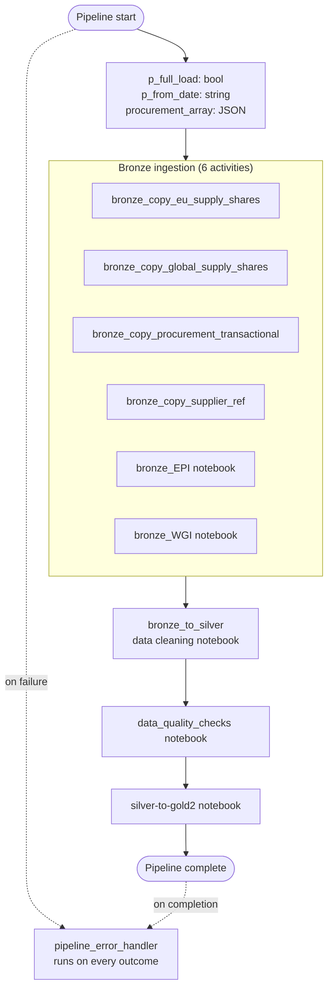
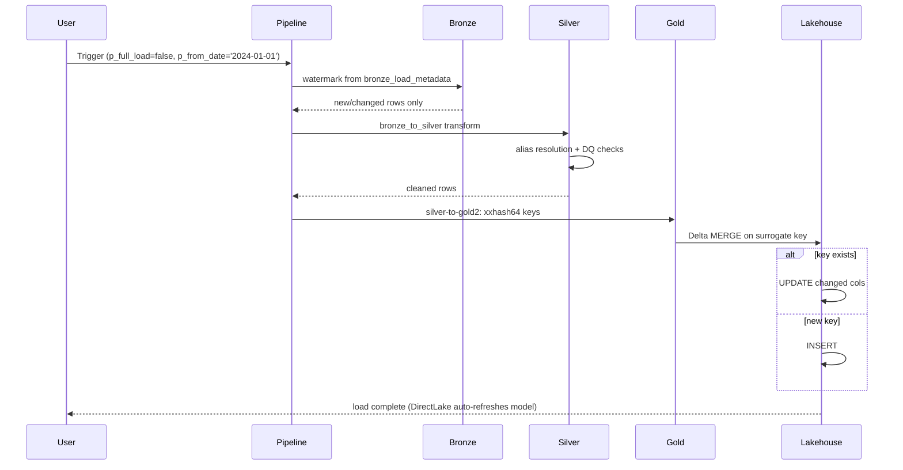
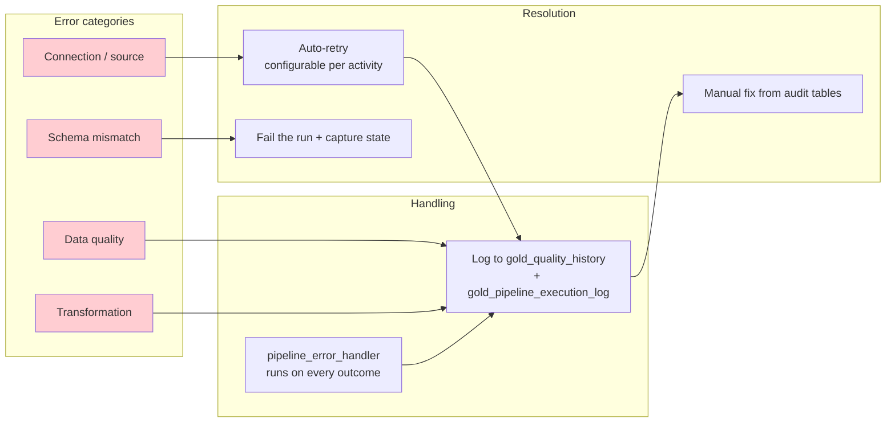

# Data Flow Architecture

End-to-end flow from external sources through the medallion layers to the DirectLake semantic model. Table names mirror the live lakehouse (`oem_lh`); activity names mirror `fabric/orchestrator_pipeline_bronze_to_gold.DataPipeline/pipeline-content.json` (10 activities).

## End-to-end pipeline flow

```mermaid
graph LR
    subgraph Sources["🌐 Sources"]
        SQL[Azure SQL<br/>procurement + supplier ref]
        EPI[EPI Yale<br/>Environmental Performance]
        WGI[World Bank<br/>WGI governance]
        EU[EU supply-shares<br/>feed]
        GLOB[Global supply-shares<br/>feed]
    end

    subgraph Bronze["🥉 Bronze"]
        B1[bronze_procurement_transactional]
        B2[bronze_supplier_ref]
        B3[bronze_EUSupplyShares]
        B4[bronze_GlobalSupplyShares]
        B5[bronze_epi2024results<br/>bronze_epi{year}weights]
        B6[bronze_WGI]
        B7[bronze_load_metadata]
    end

    subgraph Silver["🥈 Silver"]
        S1[silver_procurement]
        S2[silver_eusupplyshares<br/>silver_globalsupplyshares]
        S3[silver_epi2024results<br/>silver_epi{year}variables]
        S4[silver_wgi]
        S5[mapping_country/material<br/>_aliases_confidence]
    end

    subgraph Gold["🥇 Gold"]
        F1[fact_procurement]
        F2[fact_supply_share]
        F3[fact_epi_score]
        D[gold_dim_country/date/<br/>material/indicator/stage]
        R[gold_supply_risk]
        Q[gold_data_gaps<br/>gold_gap_registry<br/>gold_quality_history<br/>gold_low_confidence_audit]
    end

    subgraph Serving["📊 Serving"]
        LH[oem_lh lakehouse<br/>Delta tables]
        SM[OEMInsightBI_v2<br/>DirectLake semantic model]
        PBI[Power BI report]
    end

    SQL --> B1 & B2
    EU --> B3
    GLOB --> B4
    EPI --> B5
    WGI --> B6

    B1 --> S1
    B2 --> S1
    B3 --> S2
    B4 --> S2
    B5 --> S3
    B6 --> S4
    S1 --> F1
    S2 --> F2
    S3 --> F3
    S1 & S2 & S3 & S4 --> D
    S2 --> R
    S1 & S3 & S4 --> Q
    B7 -.watermark.-> S1

    F1 & F2 & F3 & D & R & Q --> LH
    LH --> SM
    SM --> PBI

    style Sources fill:#e1f5fe
    style Bronze fill:#fff3e0
    style Silver fill:#f3e5f5
    style Gold fill:#fff9c4
    style Serving fill:#e8f5e9
```

The semantic model reads Delta tables in the `oem_lh` **lakehouse** directly via DirectLake — there is no warehouse or copy step between gold and the model. `bronze_load_metadata` feeds the watermark used for incremental loads (see `incremental_load_strategy.md`).

## Pipeline orchestration



`pipeline_error_handler` is wired to run on **every** outcome (success or failure) so the observability tables (`gold_quality_history`, `gold_pipeline_execution_log`) always capture a run record. The three Copy activities load Azure SQL / CSV feeds into bronze; the EPI and WGI notebooks load the external environmental and governance sources.

## Incremental load pattern



Gold tables are Delta and load via `MERGE` on the deterministic surrogate key — see `incremental_load_strategy.md` for measured timings and the watermark mechanism.

## Error handling flow



The error handler writes a structured record for every run so failures are auditable after the fact. See `error_recovery_playbook.md` for the operational playbook (retry table per activity) and `error_handling_strategy.md` for the design rationale.

## Related docs

- `medallion_architecture.md` — layer responsibilities
- `orchestration.md` — pipeline activity detail
- `incremental_load_strategy.md` — MERGE + watermark
- `semantic_model.md` — DirectLake serving layer
- `error_recovery_playbook.md` — operational error recovery