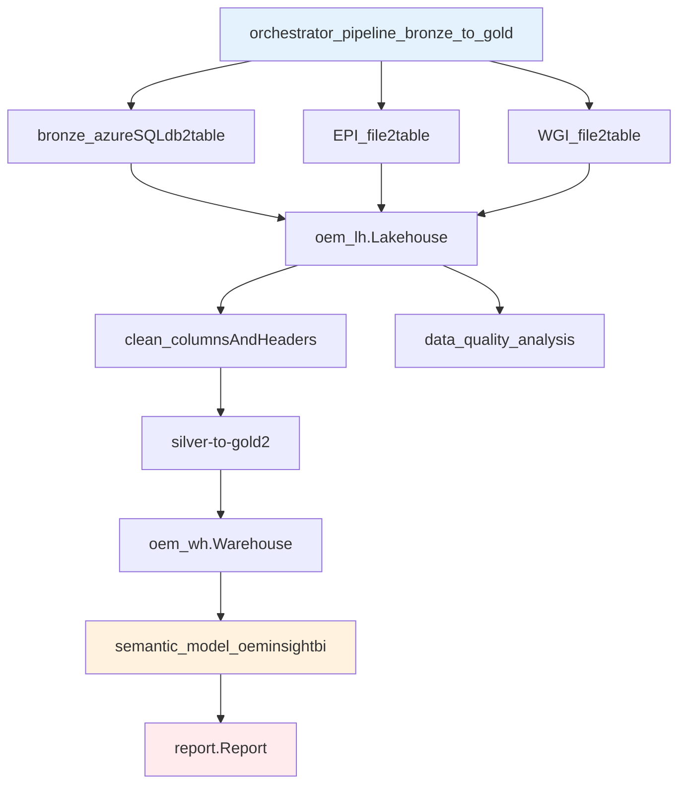

# Fabric Artifacts Inventory

## Active Artifacts (In Use)

### 🔄 Data Pipelines
| Artifact | Type | Purpose | Status |
|----------|------|---------|--------|
| `orchestrator_pipeline_bronze_to_gold` | DataPipeline | Main orchestration pipeline | ✅ Active |

### 📥 Data Flows (Bronze Layer)
| Artifact | Type | Purpose | Status |
|----------|------|---------|--------|
| `bronze_azureSQLdb2table` | Dataflow | Ingests procurement data from Azure SQL | ✅ Active |
| `EPI_file2table` | Dataflow | Ingests Environmental Performance Index data | ✅ Active |
| `WGI_file2table` | Dataflow | Ingests World Governance Indicators | ✅ Active |

### 📓 Notebooks (Transformations)
| Artifact | Type | Purpose | Status |
|----------|------|---------|--------|
| `clean_columnsAndHeaders` | Notebook | Bronze → Silver cleaning transformations | ✅ Active |
| `silver-to-gold2` | Notebook | Silver → Gold star schema creation | ✅ Active |
| `data_quality_analysis` | Notebook | Data quality monitoring and reporting | ✅ Active |

### 💾 Storage
| Artifact | Type | Purpose | Status |
|----------|------|---------|--------|
| `oem_lh` | Lakehouse | Medallion architecture storage (Bronze/Silver/Gold) | ✅ Active |
| `oem_wh` | Warehouse | SQL serving layer for Power BI | ✅ Active |

### 📊 Analytics
| Artifact | Type | Purpose | Status |
|----------|------|---------|--------|
| `semantic_model_oeminsightbi` | SemanticModel | Star schema with 18 DAX measures | ✅ Active |
| `report` | Report | Power BI report (to be developed) | 🚧 In Progress |

---

## Removed Artifacts (Archived 2025-12-15)

### ❌ Auto-Generated/Staging
| Artifact | Type | Reason for Removal | Backup Location |
|----------|------|-------------------|-----------------|
| `StagingLakehouseForDataflows_20250822093021` | SemanticModel | Auto-generated staging model | `.archive/fabric-cleanup-20251215-132143/` |
| `StagingWarehouseForDataflows_20250822093045` | SemanticModel | Auto-generated staging model | `.archive/fabric-cleanup-20251215-132143/` |

### ❌ Empty/Unused
| Artifact | Type | Reason for Removal | Backup Location |
|----------|------|-------------------|-----------------|
| `oem_wh.SemanticModel` | SemanticModel | Empty model (only 3 TMDL files), superseded by `semantic_model_oeminsightbi` | `.archive/fabric-cleanup-20251215-132143/` |
| `oem_lh.SemanticModel` | SemanticModel | Auto-generated from lakehouse (only 2 TMDL files) | `.archive/fabric-cleanup-20251215-132143/` |
| `copyjob1.CopyJob` | CopyJob | Experimental/unused copy operation | `.archive/fabric-cleanup-20251215-132143/` |

---

## Artifact Naming Conventions

### ✅ Good Naming (Current)
- `semantic_model_oeminsightbi` - Clear purpose and project name
- `orchestrator_pipeline_bronze_to_gold` - Descriptive flow
- `bronze_azureSQLdb2table` - Layer + source + operation

### ⚠️ Areas for Improvement
- `silver-to-gold2` → Consider renaming to `transform_silver_to_gold`
- `clean_columnsAndHeaders` → Consider `transform_bronze_to_silver`

---

## Artifact Dependencies

---

## Storage Impact

### Before Cleanup
- **Total Fabric Artifacts**: 16
- **Semantic Models**: 5 (3 unused)
- **Git Repository Size**: Larger due to tracking auto-generated files

### After Cleanup
- **Total Fabric Artifacts**: 11 (-31% reduction)
- **Semantic Models**: 1 (only the active one)
- **Benefit**: Cleaner repository, no confusion about which artifacts are active

---

## Maintenance Guidelines

### When to Remove Artifacts
1. **Auto-generated models** from dataflows (prefix: `Staging*`)
2. **Empty semantic models** with < 5 TMDL files
3. **Experimental artifacts** not referenced in pipelines
4. **Duplicate models** superseded by newer versions

### When to Keep Artifacts
1. **Referenced in pipelines** even if not currently active
2. **Contains business logic** (DAX measures, transformations)
3. **Part of medallion architecture** (bronze/silver/gold)
4. **Required for Power BI** reports

---

*Last Updated: 2025-12-15*
*Next Review: After Task 014 completion (Power BI development)*