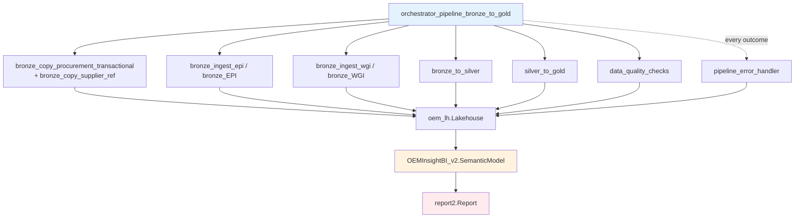

# Fabric Artifacts Inventory

As-built inventory of Fabric artifacts in the `oem_lh` workspace. Mirrors what is tracked in `fabric/` in this repo (the source `fabric-cicd` deploys from).

## Active artifacts

### 🔄 Pipeline

| Artifact | Type | Purpose | Status |
|---|---|---|---|
| `orchestrator_pipeline_bronze_to_gold` | DataPipeline | Main orchestration (10 activities: 4 Copy + 6 Notebook) | ✅ Active |

### 📓 Notebooks

| Artifact (repo dir) | Pipeline activity | Purpose | Status |
|---|---|---|---|
| `bronze_ingest_epi` | `bronze_EPI` | EPI ingestion from Yale (since task-035) | ✅ Active |
| `bronze_ingest_wgi` | `bronze_WGI` | WGI ingestion from World Bank API (since task-035) | ✅ Active |
| `bronze_to_silver` | `bronze_to_silver_cleaning` | Bronze → Silver cleaning + alias resolution | ✅ Active |
| `silver_to_gold` | `silver_to_gold` | Silver → Gold star schema (facts, dims, observability) | ✅ Active |
| `data_quality_checks` | `data_quality_checks` | Pipeline data-quality gate | ✅ Active |
| `pipeline_error_handler` | `pipeline_error_handler` | Error categorisation + execution-log write; runs on **every** outcome | ✅ Active |
| `data_quality_analysis` | — | DQ analysis (manual run, not on pipeline path) | ✅ Active (manual) |
| `sample-quality-data` | — | Demo-seed notebook for sample DQ rows | ⚠️ Demo seed — not part of the production pipeline path |

### 💾 Storage & serving

| Artifact | Type | Purpose | Status |
|---|---|---|---|
| `oem_lh` | Lakehouse | Medallion storage (Bronze/Silver/Gold Delta tables); **DirectLake source for the semantic model** | ✅ Active |
| `oem_wh` | Warehouse | SQL analytics endpoint over the lakehouse | Exists — but **not** in the semantic-model path (the model reads `oem_lh` directly, see `semantic_model.md`) |

### 📊 Analytics

| Artifact | Type | Purpose | Status |
|---|---|---|---|
| `OEMInsightBI_v2` | SemanticModel | Star schema, DirectLake on `oem_lh`, **45 measures** across 8 tables / 10 relationships | ✅ Active |
| `report2` | Report | Power BI report over the semantic model | ✅ Active |

### 📥 Dataflows (retired / orphan)

| Artifact | Type | Purpose | Status |
|---|---|---|---|
| `EPI_file2table` | Dataflow | EPI ingestion mechanism before task-035 | ❌ Orphan — replaced by `bronze_ingest_epi` notebook (task-035); still a workspace item, not on the pipeline path |
| `WGI_file2table` | Dataflow | WGI ingestion mechanism before task-035 | ❌ Orphan — replaced by `bronze_ingest_wgi` notebook (task-035); still a workspace item, not on the pipeline path |

> The retired dataflows are slated for removal via `fabric-cicd`'s `unpublish_all_orphan_items()` in a later cleanup pass. They have no consumers — the EPI/WGI notebooks write `bronze_epi2024results` / `bronze_WGI` directly.

## Previously removed (archived 2025-12-15)

| Artifact | Type | Reason | Backup |
|---|---|---|---|
| `bronze_azureSQLdb2table` | Dataflow | Replaced by Copy activities `bronze_copy_procurement_transactional` + `bronze_copy_supplier_ref` (2026-07-31) | `.claude/support/retired/bronze-azuresqldb2table-dataflow/manifest.json` |
| `StagingLakehouseForDataflows_20250822093021` | SemanticModel | Auto-generated staging model | `.archive/fabric-cleanup-20251215-132143/` |
| `StagingWarehouseForDataflows_20250822093045` | SemanticModel | Auto-generated staging model | `.archive/fabric-cleanup-20251215-132143/` |
| `oem_wh.SemanticModel` | SemanticModel | Empty model superseded by `OEMInsightBI_v2` | `.archive/fabric-cleanup-20251215-132143/` |
| `oem_lh.SemanticModel` | SemanticModel | Auto-generated from lakehouse | `.archive/fabric-cleanup-20251215-132143/` |
| `copyjob1.CopyJob` | CopyJob | Experimental/unused copy operation | `.archive/fabric-cleanup-20251215-132143/` |

## Artifact dependencies

```mermaid
graph TD
    Pipeline[orchestrator_pipeline_bronze_to_gold]

    BC1[bronze_copy_procurement_transactional<br/>+ bronze_copy_supplier_ref]
    BE[bronze_ingest_epi / bronze_EPI]
    BW[bronze_ingest_wgi / bronze_WGI]

    BS[bronze_to_silver]
    SG[silver_to_gold]
    DQ[data_quality_checks]
    EH[pipeline_error_handler]

    LH[oem_lh.Lakehouse]
    SM[OEMInsightBI_v2.SemanticModel]
    Report[report2.Report]

    Pipeline --> BC1 & BE & BW & BS & SG & DQ
    BC1 --> LH
    BE --> LH
    BW --> LH
    BS --> LH
    SG --> LH
    DQ --> LH
    Pipeline -.every outcome.-> EH
    EH --> LH

    LH --> SM
    SM --> Report

    style Pipeline fill:#e3f2fd
    style SM fill:#fff3e0
    style Report fill:#ffebee
```

The model's DirectLake source is `oem_lh`; `oem_wh` is intentionally absent from this graph (the model does not read it). EPI/WGI ingestion is via notebooks, not the orphan dataflows.

## Naming-convention status

- ✅ `orchestrator_pipeline_bronze_to_gold` — clear, snake_case
- ✅ `oem_lh`, `oem_wh` — short, lowercase
- ✅ `silver_to_gold` — renamed from `silver-to-gold2` in Phase 5 (snake_case, dropped the version stamp)
- ⚠️ `OEMInsightBI_v2`, `report2` — version suffix / placeholder name; Phase 5 rename targets `OEMInsightBI` / `oem_report`
- ⚠️ Bronze Copy activities (`bronzecopy_*`) and PascalCase bronze activities (`bronze_EPI`, `bronze_WGI`) deviate from snake_case; Phase 4–5 naming sweep targets these

See `standards/naming_standards.md` for the canonical convention (snake_case, layer-prefixed) and the planned reconciliations.

## Maintenance guidelines

**Remove when:** auto-generated `Staging*` models; empty semantic models with no business logic; experimental artifacts not referenced by the pipeline; artifacts superseded by a replacement (with a retirement manifest under `.claude/support/retired/`).

**Keep when:** referenced by the pipeline; carries business logic (DAX, transforms); part of the medallion; required by the report.

## Related docs

- `semantic_model.md` — semantic model detail (DirectLake on `oem_lh`)
- `orchestration.md` — pipeline activity detail
- `standards/naming_standards.md` — naming conventions + planned renames