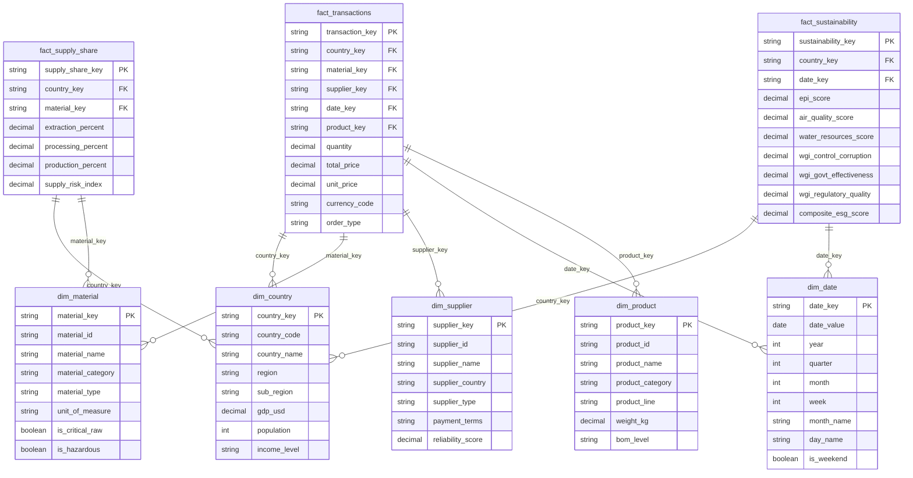
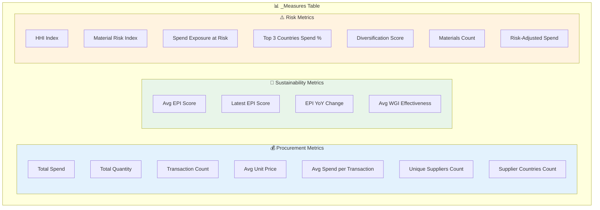
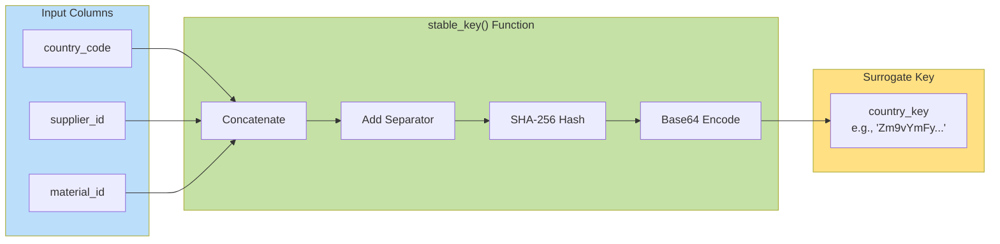
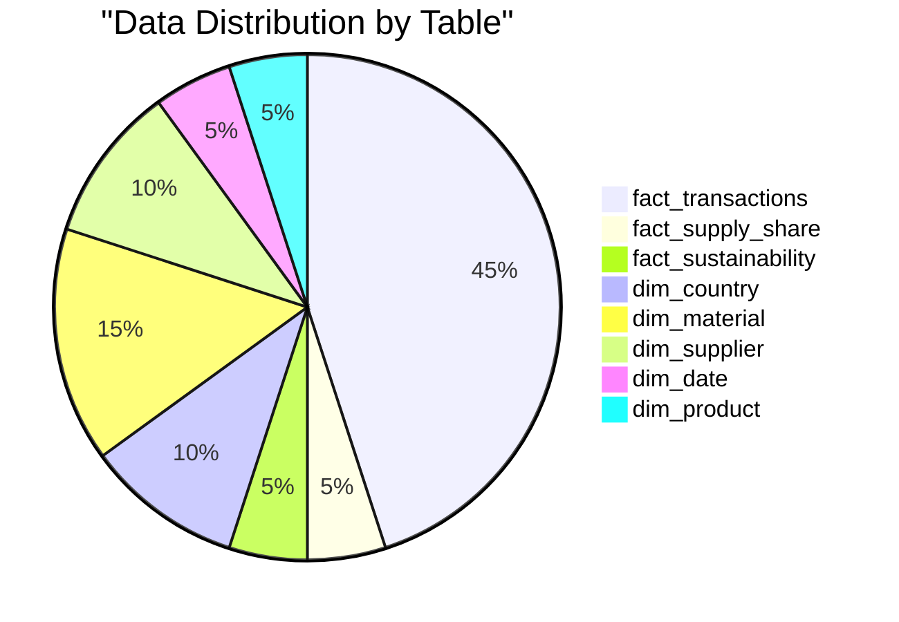

# Star Schema Entity Relationship Diagram

## Semantic Model Overview

## Measure Table Structure

## Relationship Cardinality

| From Table | To Table | Relationship Type | Cardinality | Active |
|------------|----------|-------------------|-------------|---------|
| fact_transactions | dim_country | Many-to-One | M:1 | ✅ Yes |
| fact_transactions | dim_material | Many-to-One | M:1 | ✅ Yes |
| fact_transactions | dim_supplier | Many-to-One | M:1 | ✅ Yes |
| fact_transactions | dim_date | Many-to-One | M:1 | ✅ Yes |
| fact_transactions | dim_product | Many-to-One | M:1 | ✅ Yes |
| fact_supply_share | dim_country | Many-to-One | M:1 | ✅ Yes |
| fact_supply_share | dim_material | Many-to-One | M:1 | ✅ Yes |
| fact_sustainability | dim_country | Many-to-One | M:1 | ✅ Yes |
| fact_sustainability | dim_date | Many-to-One | M:1 | ❌ No (avoid ambiguity) |

## Key Generation Pattern

## Data Volume Estimates

### Row Count Estimates
- **fact_transactions**: ~50,000 rows (2 years of data)
- **fact_supply_share**: ~5,000 rows (country-material combinations)
- **fact_sustainability**: ~400 rows (200 countries × 2 years)
- **dim_country**: ~200 rows
- **dim_material**: ~1,000 rows
- **dim_supplier**: ~500 rows
- **dim_date**: ~730 rows (2 years)
- **dim_product**: ~100 rows

---

*Last Updated: 2025-12-15*