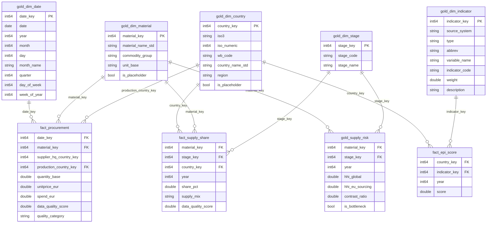
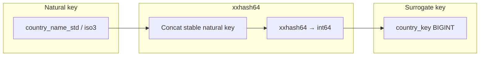

# Star Schema ERD — OEMMatInsightBI

The as-built semantic model (`OEMInsightBI_v2`, DirectLake on `oem_lh`) is a star schema of 3 fact tables + 5 dimension tables + 1 derived gold table, connected by 10 active single-direction relationships. This diagram mirrors `fabric/OEMInsightBI_v2.SemanticModel/definition/relationships.tmdl`.

## Entity-relationship diagram

```mermaid
erDiagram
    gold_dim_date           ||--o{ fact_procurement   : "date_key"
    gold_dim_material       ||--o{ fact_procurement   : "material_key"
    gold_dim_country        ||--o{ fact_procurement   : "production_country_key"
    gold_dim_country        ||--o{ fact_epi_score      : "country_key"
    gold_dim_indicator      ||--o{ fact_epi_score      : "indicator_key"
    gold_dim_country        ||--o{ fact_supply_share   : "country_key"
    gold_dim_material       ||--o{ fact_supply_share   : "material_key"
    gold_dim_stage          ||--o{ fact_supply_share   : "stage_key"
    gold_dim_material       ||--o{ gold_supply_risk    : "material_key"
    gold_dim_stage          ||--o{ gold_supply_risk    : "stage_key"

    fact_procurement {
        int64  date_key FK
        int64  material_key FK
        int64  supplier_hq_country_key
        int64  production_country_key FK
        double quantity_base
        double unitprice_eur
        double spend_eur
        double data_quality_score
        string quality_category
    }
    fact_epi_score {
        int64  country_key FK
        int64  indicator_key FK
        int64  year
        double score
    }
    fact_supply_share {
        int64  material_key FK
        int64  stage_key FK
        int64  country_key FK
        int64  year
        double share_pct
        string supply_mix
        double data_quality_score
    }
    gold_supply_risk {
        int64  material_key FK
        int64  stage_key FK
        int64  year
        double hhi_global
        double hhi_eu_sourcing
        double contrast_ratio
        bool   is_bottleneck
    }
    gold_dim_country {
        int64  country_key PK
        string iso3
        int64  iso_numeric
        string wb_code
        string country_name_std
        string region
        bool   is_placeholder
    }
    gold_dim_date {
        int64  date_key PK
        date   date
        int64  year
        int64  month
        int64  day
        string month_name
        int64  quarter
        int64  day_of_week
        int64  week_of_year
    }
    gold_dim_material {
        int64  material_key PK
        string material_name_std
        string commodity_group
        string unit_base
        bool   is_placeholder
    }
    gold_dim_indicator {
        int64  indicator_key PK
        string source_system
        string type
        string abbrev
        string variable_name
        string indicator_code
        double weight
        string description
    }
    gold_dim_stage {
        int64  stage_key PK
        string stage_code
        string stage_name
    }
```

## Relationship cardinality

All relationships are many-to-one (fact `*` → dimension `1`), single-direction filtering (dimension filters fact, not the reverse), and active.

| Fact table | Dimension | Join key | Cardinality |
|---|---|---|---|
| `fact_procurement` | `gold_dim_date` | `date_key` | M:1 |
| `fact_procurement` | `gold_dim_material` | `material_key` | M:1 |
| `fact_procurement` | `gold_dim_country` | `production_country_key` | M:1 |
| `fact_epi_score` | `gold_dim_country` | `country_key` | M:1 |
| `fact_epi_score` | `gold_dim_indicator` | `indicator_key` | M:1 |
| `fact_supply_share` | `gold_dim_country` | `country_key` | M:1 |
| `fact_supply_share` | `gold_dim_material` | `material_key` | M:1 |
| `fact_supply_share` | `gold_dim_stage` | `stage_key` | M:1 |
| `gold_supply_risk` | `gold_dim_material` | `material_key` | M:1 |
| `gold_supply_risk` | `gold_dim_stage` | `stage_key` | M:1 |

`gold_dim_country` is shared across three facts (`fact_procurement` via `production_country_key`, `fact_epi_score`, `fact_supply_share`). `gold_dim_material` is shared across `fact_procurement`, `fact_supply_share`, and `gold_supply_risk`.

> `fact_procurement.supplier_hq_country_key` is **not** a relationship — it is an attribute column counted by the `Supplier Countries Count` measure. Only `production_country_key` joins to `gold_dim_country`.

## Surrogate key generation

Surrogate keys (`country_key`, `material_key`, `indicator_key`, `stage_key`) are deterministic `xxhash64` hashes of the natural key, produced in the silver→gold transform. `date_key` is an `yyyyMMdd` integer, not a hash.

```mermaid
flowchart LR
    subgraph Input["Natural key"]
        C1[country_name_std / iso3]
    end
    subgraph Process["xxhash64"]
        P1[Concat stable natural key]
        P2[xxhash64 → int64]
    end
    subgraph Output["Surrogate key"]
        K1[country_key BIGINT]
    end
    C1 --> P1 --> P2 --> K1
```

Deterministic hashing means the same natural key produces the same key across runs, so Delta `MERGE` joins on the key without re-deriving it. (An earlier draft described SHA-256 + base64 keys; the as-built keys are `xxhash64` integers.)

## Measure placement

Measures live on the table that owns their grain — there is **no `_Measures` table**. They are grouped with display folders:

| Table | Folder | Measures |
|---|---|---|
| `fact_procurement` | — | 5 procurement measures |
| `fact_epi_score` | — | 3 EPI measures |
| `fact_supply_share` | — | 1 concentration measure |
| `gold_supply_risk` | — | 3 HHI measures |
| `gold_data_gaps` | `Data Gaps` | 16 coverage measures |
| `gold_gap_registry` | `Quality Observability` | 7 gap-lifecycle measures |
| `gold_quality_history` | `Quality Observability` | 5 run-history measures |
| `gold_low_confidence_audit` | `Quality Observability` | 5 confidence measures |

See `dax_measure_library.md` for the full catalogue.

## Observability tables

Four gold tables carry no outbound relationships — they back report visuals directly:

- `gold_data_gaps` — EPI/WGI coverage per procurement country
- `gold_gap_registry` — tracked gaps (Open→Resolved lifecycle)
- `gold_quality_history` — per-run quality metrics
- `gold_low_confidence_audit` — low-confidence alias matches
- `gold_data_gaps_summary` — long-form metric rollup (no measures)

## Related docs

- `semantic_model.md` — model overview and DirectLake configuration
- `dax_measure_library.md` — as-built measure catalogue
- `data_quality_architecture.md` — observability surface design